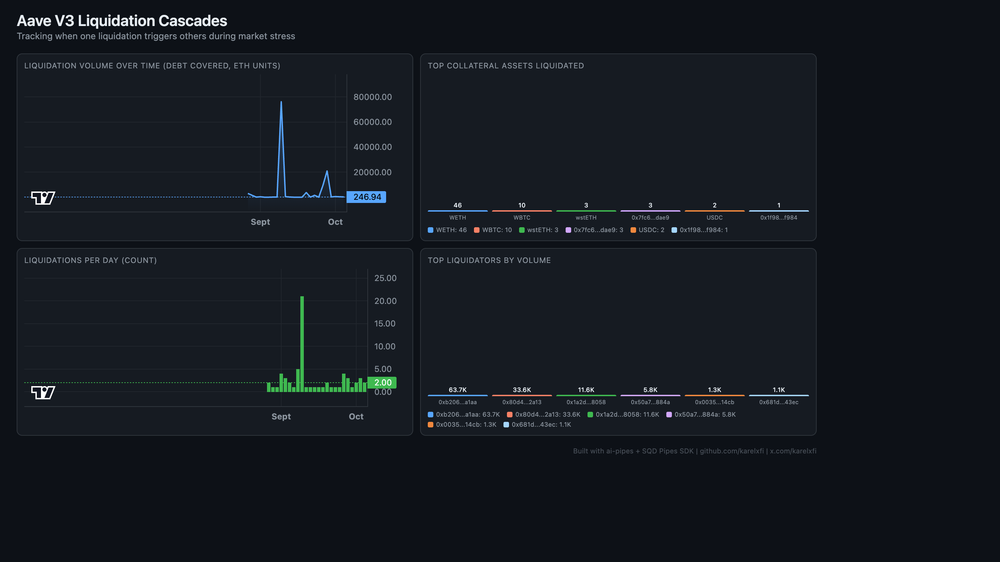

# Aave V3 — Liquidation Cascades



Track liquidation events on Aave V3 to analyze cascading liquidations during market stress.

## Run

```bash
docker compose up -d
npm install
npm start
```

## Validate

```bash
npx tsx validate.ts
```

## Dashboard

Open `dashboard/index.html` in your browser after the indexer has synced.

## Sample Query

```sql
SELECT
  toDate(timestamp) as day,
  count() as liquidations,
  sum(debt_to_cover) as total_debt_covered
FROM aave_v3_pool.aave_v_3_pool_liquidation_call
GROUP BY day
ORDER BY day DESC
LIMIT 10
```
