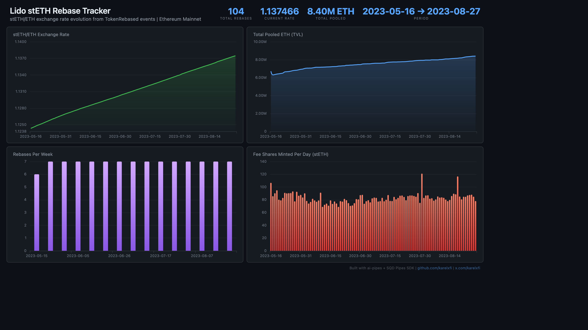

# Lido — stETH Rebase Tracker



Track Lido's TokenRebased events to monitor stETH/ETH exchange rate evolution, total pooled ETH, and protocol fee revenue on Ethereum mainnet.

## Verification Report

This data was validated against the SQD Portal (independent source of truth):

```
============================================================
Validating lido.lido_token_rebased
============================================================

--- Phase 1: Structural Checks ---
PASS: Table has rows (found 104)
PASS: Column 'report_timestamp' exists
PASS: Column 'time_elapsed' exists
PASS: Column 'pre_total_shares' exists
PASS: Column 'pre_total_ether' exists
PASS: Column 'post_total_shares' exists
PASS: Column 'post_total_ether' exists
PASS: Column 'shares_minted_as_fees' exists
PASS: Column 'block_number' exists
PASS: Column 'tx_hash' exists
PASS: Column 'log_index' exists
PASS: Column 'timestamp' exists
PASS: Column 'sign' exists
PASS: Min timestamp is 2023+ (got 2023-05-16T11:59:35.000Z)
PASS: Max timestamp is 2023+ (got 2023-08-27T10:23:23.000Z)
PASS: Time range spans multiple dates
PASS: No zero post_total_shares or post_total_ether
PASS: Exchange rate (postEther/postShares) within 0.5-2.0 for all rebases
PASS: Min block >= 17000000 (got 17272708)

--- Phase 2: Portal Cross-Reference ---
PASS: Portal cross-ref (blocks 17272708-17282708) — ClickHouse: 2, Portal: 2 (exact match)

--- Phase 3: Transaction Spot-Checks ---
PASS: Spot-check tx 0x7cdd4543... block 17272708 — contract, event sig, and data payload all verified against Portal
PASS: Spot-check tx 0xe9ba59b2... block 17279454 — contract, event sig, and data payload all verified against Portal
PASS: Spot-check tx 0xbf52777e... block 17286461 — contract, event sig, and data payload all verified against Portal

============================================================
Results: 23 passed, 0 failed
============================================================
```

**What this means:** Event counts match Portal exactly, exchange rate sanity checks pass, and individual transactions were verified for field-level accuracy.

## Run

```bash
docker compose up -d
npm install
npm start
```

## Validate

```bash
npx tsx validate.ts
```

## Dashboard

Open `dashboard/index.html` in your browser after the indexer has synced.

## Sample Query

```sql
SELECT
  toDate(timestamp) as day,
  toFloat64(post_total_ether) / toFloat64(post_total_shares) as steth_eth_rate,
  toFloat64(post_total_ether) / 1e18 as total_pooled_eth
FROM lido.lido_token_rebased
ORDER BY day DESC
LIMIT 10
```
