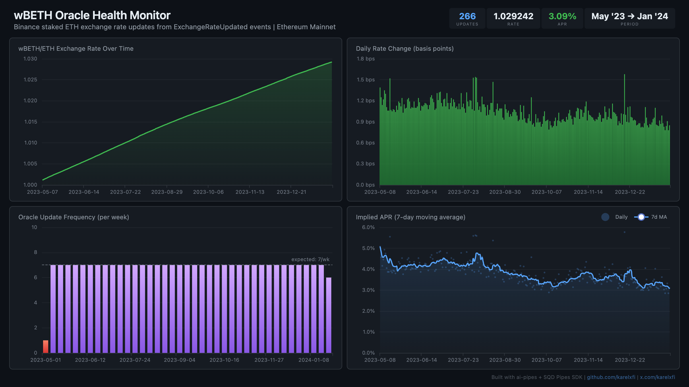

# 003 — Binance Staked ETH (wBETH) Oracle Health Monitor



## Angle

Track wBETH exchange rate updates to monitor Binance's oracle reliability, rate growth trajectory, and detect anomalies (missed updates, unusual rate changes).

## How it works

wBETH is Binance's liquid staking token. A centralized Binance oracle calls the wBETH contract daily to update the wBETH:ETH conversion ratio via `ExchangeRateUpdated(address,uint256)` events. This indexer captures every rate update since launch and derives oracle health metrics.

## Run

```bash
# Start ClickHouse
docker compose up -d

# Install deps & run indexer
npm install
npm start

# Check data
curl -s 'http://localhost:8123/?user=default&password=password' \
  --data-binary "SELECT count() FROM wbeth.wbeth_exchange_rate_updated"
```

## Validate

```bash
npx tsx validate.ts
```

## Dashboard

Open `dashboard/index.html` in a browser (ClickHouse must be running on localhost:8123).

## Sample ClickHouse Queries

```sql
-- Latest exchange rate
SELECT toFloat64(new_exchange_rate) / 1e18 as rate, timestamp
FROM wbeth.wbeth_exchange_rate_updated
ORDER BY block_number DESC LIMIT 1;

-- Implied APR from last 7 days
SELECT
  avg((curr_rate - prev_rate) / prev_rate * 365.25 * 100) as implied_apr_pct
FROM (
  SELECT
    toFloat64(new_exchange_rate) / 1e18 as curr_rate,
    lagInFrame(toFloat64(new_exchange_rate) / 1e18) OVER (ORDER BY block_number) as prev_rate
  FROM wbeth.wbeth_exchange_rate_updated
  ORDER BY block_number DESC
  LIMIT 8
) WHERE prev_rate > 0;

-- Weeks with missed updates (< 6 updates)
SELECT toMonday(timestamp) as week, count() as updates
FROM wbeth.wbeth_exchange_rate_updated
GROUP BY week
HAVING updates < 6
ORDER BY week;
```

## Verification Report

This data was validated against the SQD Portal:

```
============================================================
Validating wbeth.wbeth_exchange_rate_updated
============================================================

--- Phase 1: Structural Checks ---
PASS: Table has rows (found 266)
PASS: Column 'caller' exists
PASS: Column 'new_exchange_rate' exists
PASS: Column 'block_number' exists
PASS: Column 'tx_hash' exists
PASS: Column 'log_index' exists
PASS: Column 'timestamp' exists
PASS: Column 'sign' exists
PASS: Min timestamp is 2023+ (got 2023-05-06T22:02:11.000Z)
PASS: Max timestamp is 2023+ (got 2024-01-26T23:02:11.000Z)
PASS: Time range spans multiple dates
PASS: All exchange rates within 0.9-1.5 ETH range
PASS: Rate decreases are rare (found 0, expected <=5)
PASS: Min block >= 17200000 (got 17204978)

--- Phase 2: Portal Cross-Reference ---
PASS: Portal cross-ref (blocks 17204978-17214978) — ClickHouse: 2, Portal: 2 (exact match)

--- Phase 3: Transaction Spot-Checks ---
PASS: Spot-check tx 0x4166d978... block 17204978 — contract, event sig, and data payload all verified against Portal
PASS: Spot-check tx 0x6f35406e... block 17212091 — contract, event sig, and data payload all verified against Portal
PASS: Spot-check tx 0x0f083e68... block 17219205 — contract, event sig, and data payload all verified against Portal

============================================================
Results: 18 passed, 0 failed
============================================================
```

**What this means:** Event counts match Portal exactly, exchange rates are sane (monotonically increasing, 0.9-1.5 range), and individual transactions verified against Portal.

## Contract Details

- **Proxy**: `0xa2E3356610840701BDf5611a53974510Ae27E2e1` (AdminUpgradeabilityProxy)
- **Implementation**: `0x9e021c9607bd3adb7424d3b25a2d35763ff180bb` (WrapTokenV3ETH)
- **Event**: `ExchangeRateUpdated(address indexed caller, uint256 newExchangeRate)`
- **Oracle**: `0x81720695e43a39c52557ce6386feb3faac215f06`
- **Start block**: 17,200,000 (~May 2023)
