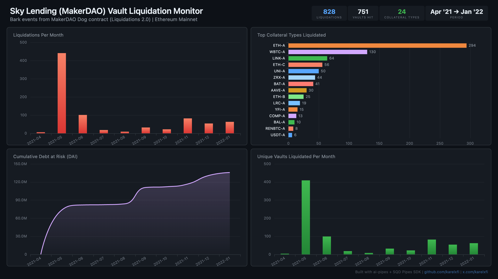

# Sky Lending (MakerDAO) — Vault Liquidation Monitor



Track vault liquidations across all collateral types on MakerDAO's Liquidations 2.0 system (Dog contract) since April 2021.

## Verification Report

This data was validated against the SQD Portal (independent source of truth):

```
============================================================
Validating sky_lending.dog_bark
============================================================

--- Phase 1: Structural Checks ---
PASS: Table has rows (found 828)
PASS: Column 'ilk' exists
PASS: Column 'urn' exists
PASS: Column 'ink' exists
PASS: Column 'art' exists
PASS: Column 'due' exists
PASS: Column 'clip' exists
PASS: Column 'id' exists
PASS: Column 'block_number' exists
PASS: Column 'tx_hash' exists
PASS: Column 'log_index' exists
PASS: Column 'timestamp' exists
PASS: Column 'sign' exists
PASS: Min timestamp is 2021+ (got 2021-04-26T15:31:38.000Z)
PASS: Time range spans multiple dates
PASS: No empty addresses
PASS: Min block >= 12317000 (got 12317310)

--- Phase 2: Portal Cross-Reference ---
PASS: Portal cross-ref (blocks 12317310-12327310) - ClickHouse: 3, Portal: 3 (exact match)

--- Phase 3: Transaction Spot-Checks ---
PASS: Spot-check tx 0x6acf3a26... block 12317310 - contract, event, ilk all match Portal
PASS: Spot-check tx 0x18f8a168... block 12318381 - contract, event, ilk all match Portal
PASS: Spot-check tx 0x786fe78a... block 12324468 - contract, event, ilk all match Portal

============================================================
Results: 21 passed, 0 failed
============================================================
```

**What this means:** Event counts match Portal exactly, and individual liquidation transactions were verified for contract address, event signature, and collateral type (ilk) accuracy.

## Run

```bash
docker compose up -d
npm install
npm start
```

## Validate

```bash
npx tsx validate.ts
```

## Dashboard

Open `dashboard/index.html` in your browser after the indexer has synced.

## Sample Query

```sql
SELECT
  ilk,
  count() as liquidations,
  count(DISTINCT urn) as unique_vaults,
  sum(toFloat64(due) / 1e45) as total_debt_dai
FROM sky_lending.dog_bark
GROUP BY ilk
ORDER BY liquidations DESC
LIMIT 10
```
