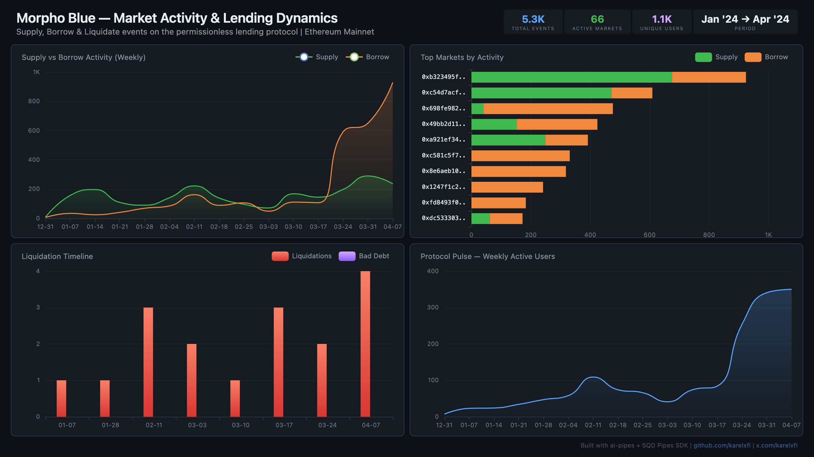

# Morpho Blue — Market Activity & Lending Dynamics



Track supply, borrow, and liquidation activity across all Morpho Blue markets on Ethereum since January 2024.

## Verification Report

This data was validated against the SQD Portal:

```
============================================================
Validating morpho_blue (3 tables)
============================================================

--- Phase 1: Structural Checks ---
PASS: morpho_blue_supply has rows (found 2267)
PASS: morpho_blue_borrow has rows (found 3057)
PASS: morpho_blue_liquidate has rows (found 17)
PASS: All columns present across 3 tables (32 checks)
PASS: Min timestamp is 2024+ (got 2024-01-03)
PASS: Min block >= 18883124

--- Phase 2: Portal Cross-Reference ---
PASS: morpho_blue_supply — ClickHouse: 1, Portal: 1 (exact match)
PASS: morpho_blue_borrow — ClickHouse: 1, Portal: 1 (exact match)
PASS: morpho_blue_liquidate — ClickHouse: 1, Portal: 1 (exact match)

--- Phase 3: Transaction Spot-Checks ---
PASS: Supply tx 0x292edb53... — contract, event, market id match
PASS: Supply tx 0x7ec5200c... — contract, event, market id match
PASS: Liquidate tx 0x0af39d52... — contract, event match

Results: 40 passed, 0 failed
============================================================
```

## Run

```bash
docker compose up -d
npm install
npm start
```

## Validate

```bash
npx tsx validate.ts
```

## Dashboard

Open `dashboard/index.html` in your browser after the indexer has synced.

## Sample Query

```sql
-- Top 10 markets by total supply + borrow event count
SELECT
  id as market_id,
  supply_cnt,
  borrow_cnt,
  supply_cnt + borrow_cnt as total
FROM (
  SELECT id, count() as supply_cnt FROM morpho_blue.morpho_blue_supply GROUP BY id
) s
FULL OUTER JOIN (
  SELECT id, count() as borrow_cnt FROM morpho_blue.morpho_blue_borrow GROUP BY id
) b USING id
ORDER BY total DESC
LIMIT 10
```
