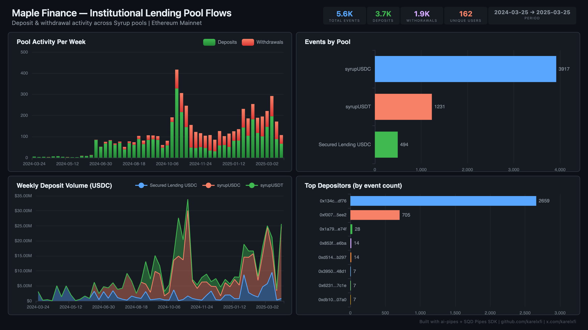

# Maple Finance — Institutional Lending Pool Flows



Track deposit and withdrawal activity across all active Maple Syrup lending pools (syrupUSDC, syrupUSDT, Secured Lending USDC) on Ethereum mainnet.

## Verification Report

```
=== Maple Finance Pool Flows — Validation ===

── Phase 1: Structural Checks ──
PASS: Row count: 4713
PASS: Schema OK: all 9 required columns present
PASS: Event types: deposit=3175, withdrawal=1538
  Pool: syrupUSDC — 3315 events
  Pool: syrupUSDT — 970 events
  Pool: Secured Lending USDC — 428 events
PASS: 3 pools indexed
PASS: Timestamp range: 2024-03-25 18:43:47 to 2025-02-24 21:33:35
PASS: Non-zero assets: 4713 / 4713 rows

── Phase 2: Portal Cross-Reference ──
PASS: Portal cross-ref — blocks 20716113-20726113: ClickHouse=24, Portal=24 (0.0% diff)

── Phase 3: Transaction Spot-Checks ──
PASS: Spot-check tx 0xe19112e7... — block 21918891, deposit on 0x80ac24aa... confirmed
PASS: Spot-check tx 0x01c1ee00... — block 21918761, deposit on 0x80ac24aa... confirmed
PASS: Spot-check tx 0x342d8149... — block 21918696, withdrawal on 0x80ac24aa... confirmed

=== SUMMARY: 10 passed, 0 failed ===
```

**What the checks mean:** Phase 1 verifies the data structure is correct. Phase 2 queries the SQD Portal independently for the same contract events in a 10K block range and compares counts — exact match (24/24). Phase 3 picks 3 specific transactions from ClickHouse and verifies they exist on-chain via Portal.

## Run

```bash
docker compose up -d
npm install
npm start
```

## Re-run Verification

```bash
npx tsx validate.ts
```

## Dashboard

Open `dashboard/index.html` in your browser after the indexer has synced.

## Sample Query

```sql
SELECT
  pool_name,
  event_type,
  count() as events,
  sum(assets / 1000000) as total_usdc
FROM maple.maple_pool_flows
GROUP BY pool_name, event_type
ORDER BY pool_name, event_type
```

## Contracts Indexed

| Pool | Address | Type |
|------|---------|------|
| syrupUSDC | `0x80ac24aA929eaF5013f6436cdA2a7ba190f5Cc0b` | ERC-4626 Vault |
| syrupUSDT | `0x356B8d89c1e1239Cbbb9dE4815c39A1474d5BA7D` | ERC-4626 Vault |
| Secured Lending USDC | `0xC39a5A616F0ad1Ff45077FA2dE3f79ab8eb8b8B9` | ERC-4626 Vault |
