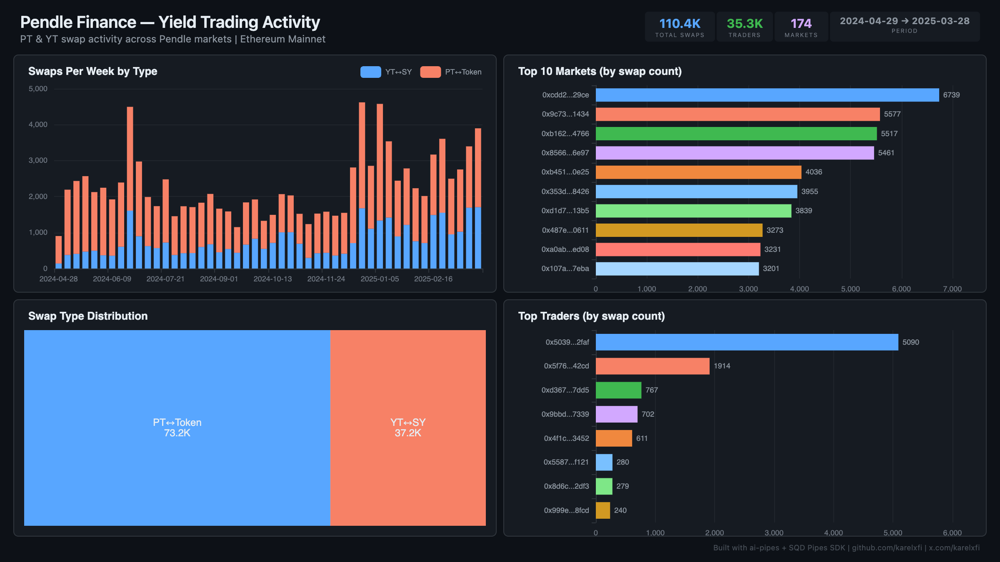

# Pendle Finance — Yield Trading Activity



Track PT (Principal Token) and YT (Yield Token) swap activity across all Pendle markets on Ethereum mainnet via the Pendle Router V4.

## Verification Report

```
=== Pendle Finance Yield Trading — Validation ===

── Phase 1: Structural Checks ──
PASS: Row count: 102953
PASS: Schema OK: all 8 required columns present
  PT↔Token: 69232 swaps
  YT↔SY: 33721 swaps
PASS: 2 swap types indexed
PASS: Timestamp range: 2024-04-29 12:10:23 to 2025-03-15 13:45:59
PASS: 169 unique markets

── Phase 2: Portal Cross-Reference ──
PASS: Portal cross-ref — blocks 20906773-20916773: ClickHouse=285, Portal=285 (0.0% diff)

── Phase 3: Transaction Spot-Checks ──
PASS: Spot-check tx 0xf183b648... — block 22067544, YT↔SY confirmed
PASS: Spot-check tx 0xf34d2a1c... — block 22067538, YT↔SY confirmed
PASS: Spot-check tx 0x7dd94ed2... — block 22067514, PT↔Token confirmed

=== SUMMARY: 9 passed, 0 failed ===
```

**What the checks mean:** Phase 1 verifies data structure. Phase 2 queries SQD Portal for swap events in a 10K block range — exact match (285/285). Phase 3 picks 3 specific transactions and confirms they exist on-chain.

## Run

```bash
docker compose up -d
npm install
npm start
```

## Re-run Verification

```bash
npx tsx validate.ts
```

## Dashboard

Open `dashboard/index.html` in your browser after the indexer has synced.

## Sample Query

```sql
SELECT
  swap_type,
  count() as swaps,
  count(DISTINCT caller) as traders,
  count(DISTINCT market) as markets
FROM pendle.pendle_swaps
GROUP BY swap_type
ORDER BY swaps DESC
```

## Contract Indexed

| Contract | Address | Notes |
|----------|---------|-------|
| Pendle Router V4 | `0x888888888889758F76e7103c6CbF23ABbF58F946` | Diamond proxy — events defined manually |
