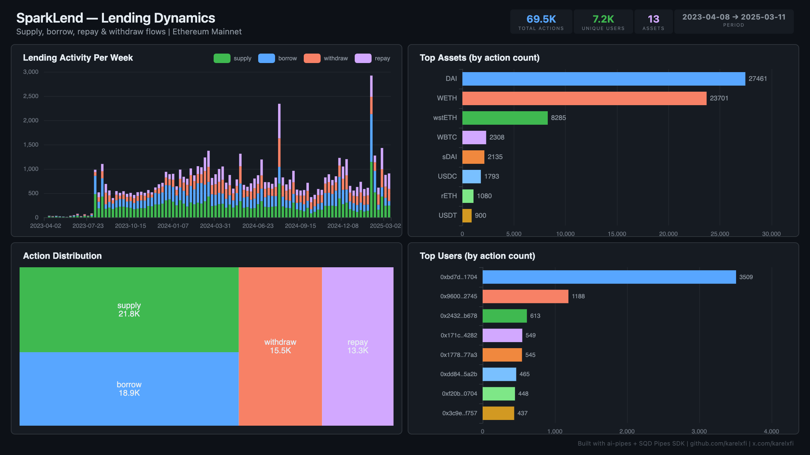

# SparkLend — Lending Dynamics



Track supply, borrow, repay, and withdraw activity on SparkLend (Aave V3 fork, Sky/MakerDAO ecosystem) on Ethereum mainnet.

## Verification Report

```
=== SparkLend Lending Dynamics — Validation ===

── Phase 1: Structural Checks ──
PASS: Row count: 66960
PASS: Schema OK: all 7 required columns present
  supply: 21130 events
  borrow: 18549 events
  withdraw: 14794 events
  repay: 12487 events
PASS: 4 action types indexed
PASS: Timestamp range: 2023-04-08 13:40:59 to 2025-02-27 07:41:35
PASS: 13 unique reserves (assets)

── Phase 2: Portal Cross-Reference ──
PASS: Portal cross-ref — blocks 19470137-19480137: ClickHouse=342, Portal=342 (0.0% diff)

── Phase 3: Transaction Spot-Checks ──
PASS: Spot-check tx 0x8a55079b... — block 21936241, supply confirmed
PASS: Spot-check tx 0xd8e4d0f9... — block 21936224, borrow confirmed
PASS: Spot-check tx 0x290d4054... — block 21936218, supply confirmed

=== SUMMARY: 9 passed, 0 failed ===
```

## Run

```bash
docker compose up -d
npm install
npm start
```

## Re-run Verification

```bash
npx tsx validate.ts
```

## Dashboard

Open `dashboard/index.html` in your browser after the indexer has synced.

## Sample Query

```sql
SELECT action, reserve, count() as events
FROM sparklend.sparklend_actions
GROUP BY action, reserve
ORDER BY events DESC
LIMIT 10
```

## Contract Indexed

| Contract | Address | Notes |
|----------|---------|-------|
| SparkLend Pool | `0xC13e21B648A5Ee794902342038FF3aDAB66BE987` | Proxy — impl ABI from `0x5ae329...` |
