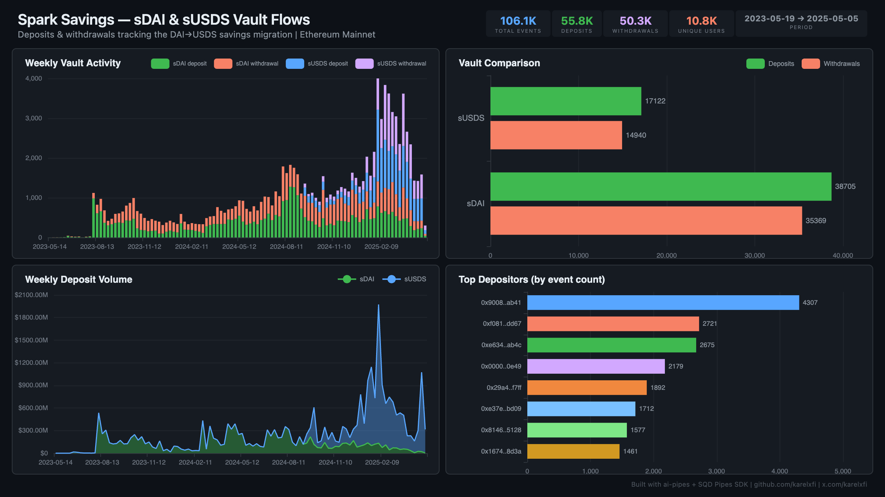

# Spark Savings — sDAI & sUSDS Vault Flows



Track deposits and withdrawals across both Sky ecosystem savings vaults (sDAI and sUSDS) on Ethereum mainnet, visualizing the DAI→USDS migration.

## Verification Report

```
=== Spark Savings (sDAI + sUSDS) — Validation ===

── Phase 1: Structural Checks ──
PASS: Row count: 103070
PASS: Schema OK: all 9 required columns present
  sDAI: 73206 events
  sUSDS: 29864 events
PASS: 2 vault(s) indexed
PASS: Event types: deposit=54260, withdrawal=48810
PASS: Timestamp range: 2023-05-19 11:02:11 to 2025-04-21 06:22:47

── Phase 2: Portal Cross-Reference ──
PASS: Portal cross-ref — blocks 19804333-19814333: ClickHouse=169, Portal=169 (0.0% diff)

── Phase 3: Transaction Spot-Checks ──
PASS: Spot-check tx 0x56c59979... — block 22315555, sUSDS withdrawal confirmed
PASS: Spot-check tx 0x084284d7... — block 22315549, sUSDS deposit confirmed
PASS: Spot-check tx 0x10d48584... — block 22315529, sDAI deposit confirmed

=== SUMMARY: 9 passed, 0 failed ===
```

## Run

```bash
docker compose up -d
npm install
npm start
```

## Dashboard

Open `dashboard/index.html` in your browser after the indexer has synced.

## Sample Query

```sql
SELECT vault_name, event_type, count() as events
FROM spark_savings.savings_flows
GROUP BY vault_name, event_type
ORDER BY vault_name, event_type
```

## Contracts Indexed

| Vault | Address | Type |
|-------|---------|------|
| sDAI | `0x83F20F44975D03b1b09e64809B757c47f942BEeA` | ERC-4626 Savings Vault |
| sUSDS | `0xa3931d71877C0E7a3148CB7Eb4463524FEc27fbD` | ERC-4626 Savings Vault (UUPS proxy) |
