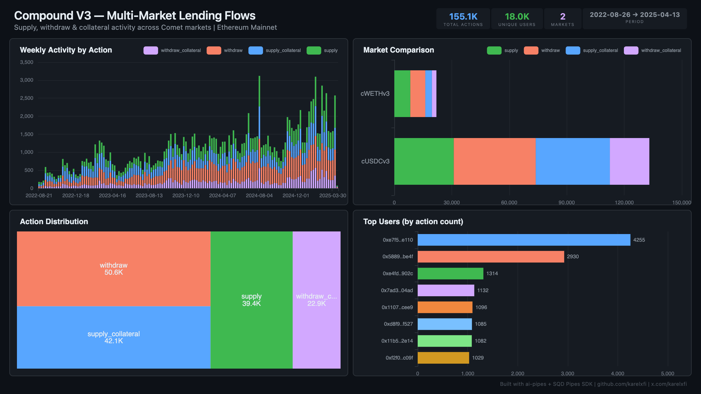

# Compound V3 — Multi-Market Lending Flows



Track supply, withdraw, and collateral activity across Compound V3's isolated Comet markets (cUSDCv3 and cWETHv3) on Ethereum mainnet.

## Verification Report

```
=== Compound V3 Multi-Market Lending — Validation ===

── Phase 1: Structural Checks ──
PASS: Row count: 149953
PASS: Schema OK: all 8 required columns present
  withdraw: 48999 events
  supply_collateral: 41022 events
  supply: 37702 events
  withdraw_collateral: 22230 events
PASS: 4 action types indexed
  cUSDCv3: 129074 events
  cWETHv3: 20879 events
PASS: 2 market(s) indexed
PASS: Timestamp range: 2022-08-26 01:00:26 to 2025-03-25 21:27:47

── Phase 2: Portal Cross-Reference ──
PASS: Portal cross-ref — blocks 18769477-18779477: ClickHouse=224, Portal=224 (0.0% diff)

── Phase 3: Transaction Spot-Checks ──
PASS: Spot-check tx 0x5d5f12f3... — block 22152282, cUSDCv3 withdraw_collateral confirmed
PASS: Spot-check tx 0x96a8c6f7... — block 22152279, cUSDCv3 supply confirmed
PASS: Spot-check tx 0xba67efd8... — block 22152257, cUSDCv3 withdraw_collateral confirmed

=== SUMMARY: 9 passed, 0 failed ===
```

## Run

```bash
docker compose up -d
npm install
npm start
```

## Dashboard

Open `dashboard/index.html` in your browser after the indexer has synced.

## Sample Query

```sql
SELECT market_name, action, count() as events
FROM compound_v3.compound_v3_actions
GROUP BY market_name, action
ORDER BY market_name, action
```

## Contracts Indexed

| Market | Address | Notes |
|--------|---------|-------|
| cUSDCv3 | `0xc3d688B66703497DAA19211EEdff47f25384cdc3` | Proxy — impl from `0xeB330B7c...` |
| cWETHv3 | `0xA17581A9E3356d9A858b789D68B4d866e593aE94` | Proxy — same Comet impl ABI |
