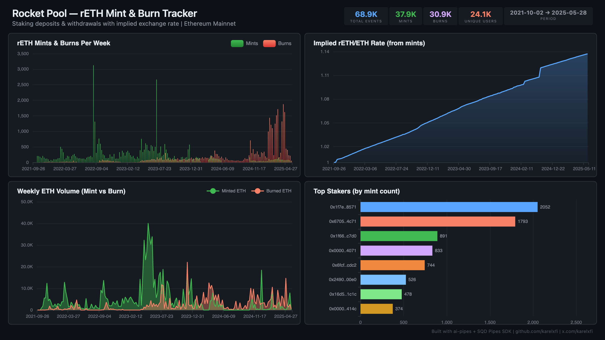

# Rocket Pool — rETH Mint & Burn Tracker



Track rETH minting (ETH staking) and burning (ETH unstaking) with implied exchange rate evolution on Ethereum mainnet.

## Verification Report

```
=== Rocket Pool rETH Mint & Burn — Validation ===

── Phase 1: Structural Checks ──
PASS: Row count: 68189
PASS: Schema OK: all 7 required columns present
  burn: 30441 events
  mint: 37748 events
PASS: Both mint and burn event types indexed
PASS: Timestamp range: 2021-10-02 04:09:15 to 2025-05-11 00:59:23
PASS: 24012 unique users

── Phase 2: Portal Cross-Reference ──
PASS: Portal cross-ref — blocks 17897172-17907172: ClickHouse=66, Portal=66 (0.0% diff)

── Phase 3: Transaction Spot-Checks ──
PASS: Spot-check tx 0x551d3ffe... — block 22456692, burn confirmed
PASS: Spot-check tx 0x7b06e6de... — block 22456411, burn confirmed
PASS: Spot-check tx 0xda5696bc... — block 22455934, burn confirmed

=== SUMMARY: 9 passed, 0 failed ===
```

## Run

```bash
docker compose up -d
npm install
npm start
```

## Dashboard

Open `dashboard/index.html` in your browser after the indexer has synced.

## Sample Query

```sql
-- rETH/ETH exchange rate over time
SELECT
  toStartOfMonth(timestamp) as month,
  avg(eth_amount / reth_amount) as implied_rate
FROM rocket_pool.reth_flows
WHERE event_type = 'mint' AND reth_amount > 0
GROUP BY month
ORDER BY month
```

## Contract Indexed

| Contract | Address | Notes |
|----------|---------|-------|
| rETH Token | `0xae78736Cd615f374D3085123A210448E74Fc6393` | NOT a proxy — direct contract |
