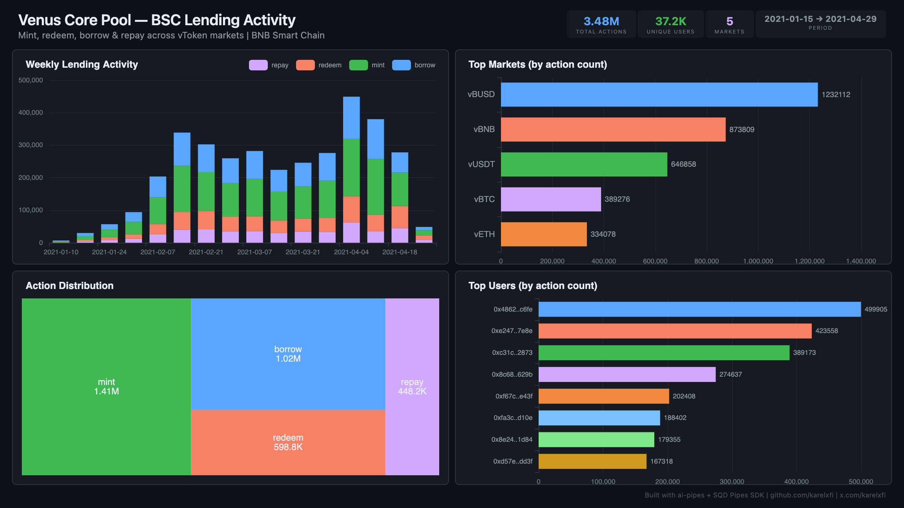

# Venus Core Pool — BSC Lending Activity



Track Mint, Redeem, Borrow, and RepayBorrow across Venus Core Pool's top vToken markets on BNB Smart Chain. First non-Ethereum EVM indexer in the collection.

## Verification Report

```
=== Venus Core Pool BSC Lending — Validation ===

── Phase 1: Structural Checks ──
PASS: Row count: 3453290
PASS: Schema OK: all 7 required columns present
  mint: 1401910 events
  borrow: 1015242 events
  redeem: 592176 events
  repay: 443962 events
PASS: 4 action types indexed
  vBUSD: 1225719 events
  vBNB: 865073 events
  vUSDT: 643119 events
  vBTC: 387207 events
  vETH: 332172 events
PASS: 5 markets indexed
PASS: Timestamp range: 2021-01-15 03:02:07 to 2021-04-26 22:43:15

── Phase 2: Portal Cross-Reference ──
PASS: Portal cross-ref — blocks 5456746-5466746: ClickHouse=10966, Portal=10966 (0.0% diff)

── Phase 3: Transaction Spot-Checks ──
PASS: Spot-check tx 0xf0472d11... — block 6923516, vBUSD borrow confirmed
PASS: Spot-check tx 0x9c25b31c... — block 6923510, vBUSD redeem confirmed
PASS: Spot-check tx 0xb6270210... — block 6923506, vBTC repay confirmed

=== SUMMARY: 9 passed, 0 failed ===
```

## Run

```bash
docker compose up -d
npm install
npm start
```

## Dashboard

Open `dashboard/index.html` in your browser after the indexer has synced.

## Sample Query

```sql
SELECT market_name, action, count() as events
FROM venus.venus_actions
GROUP BY market_name, action
ORDER BY events DESC
LIMIT 10
```

## Contracts Indexed

| Market | Address | Chain |
|--------|---------|-------|
| vBNB | `0xA07c5b74C9B40447a954e1466938b865b6BBea36` | BSC |
| vUSDT | `0xfD5840Cd36d94D7229439859C0112a4185BC0255` | BSC |
| vBUSD | `0x95c78222B3D6e262426483D42CfA53685A67Ab9D` | BSC |
| vBTC | `0x882C173bC7Ff3b7786CA16dfeD3DFFfb9Ee7847B` | BSC |
| vETH | `0xf508fCD89b8bd15579dc79A6827cB4686A3592c8` | BSC |
