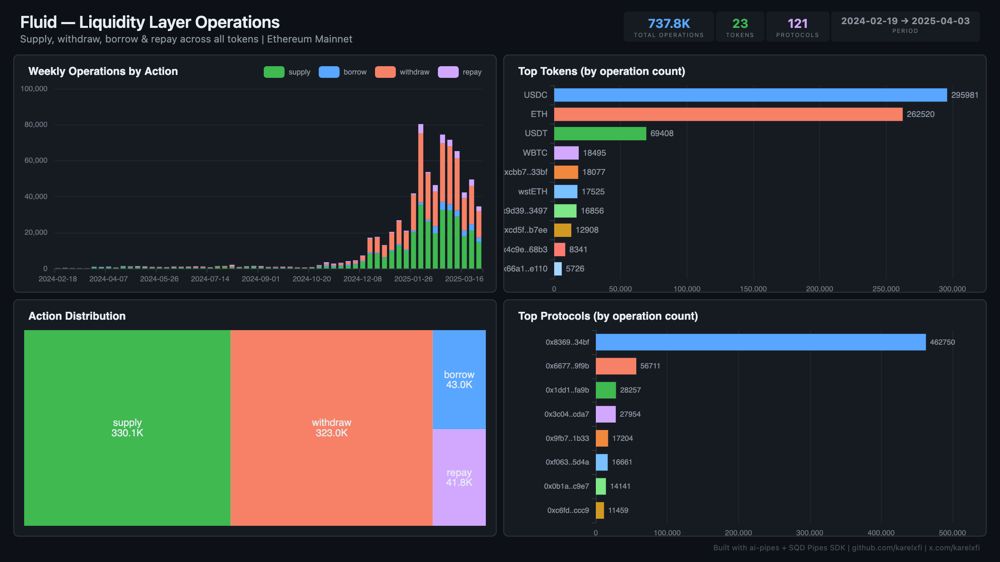

# Fluid — Liquidity Layer Operations



Track all supply, withdraw, borrow, and repay operations across Fluid's unified Liquidity Layer on Ethereum mainnet.

## Verification Report

```
=== Fluid Liquidity Layer — Validation ===

── Phase 1: Structural Checks ──
PASS: Row count: 675528
PASS: Schema OK: all 7 required columns present
  supply: 303299 events
  withdraw: 296114 events
  borrow: 38716 events
  repay: 37399 events
PASS: 4 action types indexed
  USDC: 272725 events
  ETH: 243791 events
  USDT: 60307 events
  WBTC: 17490 events
  wstETH: 16837 events
PASS: 5+ tokens indexed
PASS: Timestamp range: 2024-02-19 01:15:23 to 2025-03-27 19:05:23

── Phase 2: Portal Cross-Reference ──
PASS: Portal cross-ref — blocks 20699345-20709345: ClickHouse=180, Portal=180 (0.0% diff)

── Phase 3: Transaction Spot-Checks ──
PASS: Spot-check tx 0x66fca6dc... — block 22140226, ETH supply confirmed
PASS: Spot-check tx 0x66fca6dc... — block 22140226, USDC withdraw confirmed
PASS: Spot-check tx 0x5d15df21... — block 22140225, ETH supply confirmed

=== SUMMARY: 9 passed, 0 failed ===
```

## Run

```bash
docker compose up -d
npm install
npm start
```

## Dashboard

Open `dashboard/index.html` in your browser after the indexer has synced.

## Sample Query

```sql
SELECT token_name, action, count() as ops
FROM fluid.fluid_operations
GROUP BY token_name, action
ORDER BY ops DESC
LIMIT 10
```

## Contract Indexed

| Contract | Address | Notes |
|----------|---------|-------|
| Fluid Liquidity | `0x52Aa899454998Be5b000Ad077a46Bbe360F4e497` | Proxy — LogOperate event defined manually |
