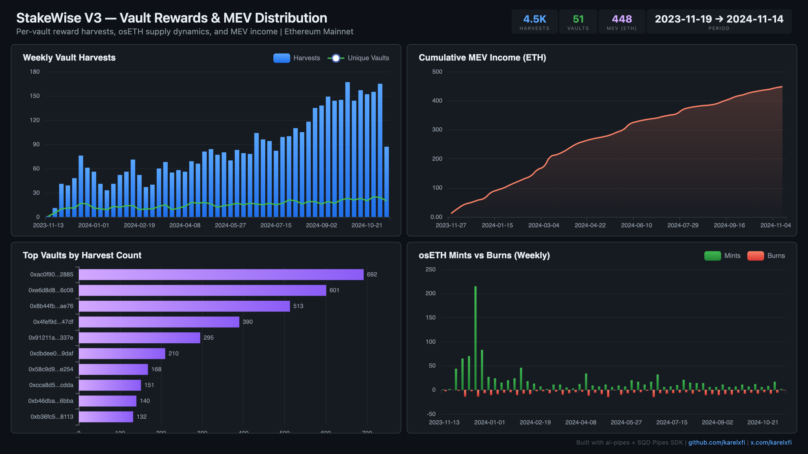

# StakeWise V3 — Vault Rewards & MEV Distribution



Track per-vault reward harvests, osETH supply dynamics, and MEV income across all StakeWise V3 vaults on Ethereum.

## Run

```bash
docker compose up -d
npm install
npm start
```

## Validate

```bash
npx tsx validate.ts
```

### Verification Report

```
=== Phase 1: Structural Checks ===

PASS: keeper_harvests: 4466 rows
PASS: ostoken_mints: 1084 rows
PASS: ostoken_burns: 376 rows
PASS: mev_received: 4797 rows
PASS: Block range: 18,605,463 → 21,186,323
PASS: Timestamp range: 2023-11-19 11:08:47.000 → 2024-11-14 13:46:47.000
PASS: No empty vault addresses in harvests
PASS: Unique vaults harvested: 51

=== Phase 2: Portal Cross-Reference ===

PASS: Portal cross-ref (Harvested): CH=14, Portal=14 (0.0% diff) — blocks 19637807-19647807

=== Phase 3: Transaction Spot-Checks ===

PASS: Spot-check block 21186323 — tx 0x23b1eb2e... vault 0x05e393ec... matches Portal
PASS: Spot-check block 21186281 — tx 0xff08809d... vault 0x579ecfe4... matches Portal
PASS: Spot-check block 21186280 — tx 0x9240a4b1... vault 0xe6d8d8ac... matches Portal

=== Results: 12 passed, 0 failed ===
```

Phase 1 checks table row counts, schema, and data ranges. Phase 2 cross-references a 10K-block sample against SQD Portal (exact match: 14 vs 14). Phase 3 verifies 3 specific transactions field-by-field against Portal data.

## Dashboard

Open `dashboard/index.html` in your browser after the indexer has synced.

## Sample Query

```sql
SELECT
    vault,
    count() as harvests,
    sum(toFloat64(total_assets_delta)) / 1e18 as total_rewards_eth
FROM stakewise.keeper_harvests
GROUP BY vault
ORDER BY total_rewards_eth DESC
LIMIT 10
```
