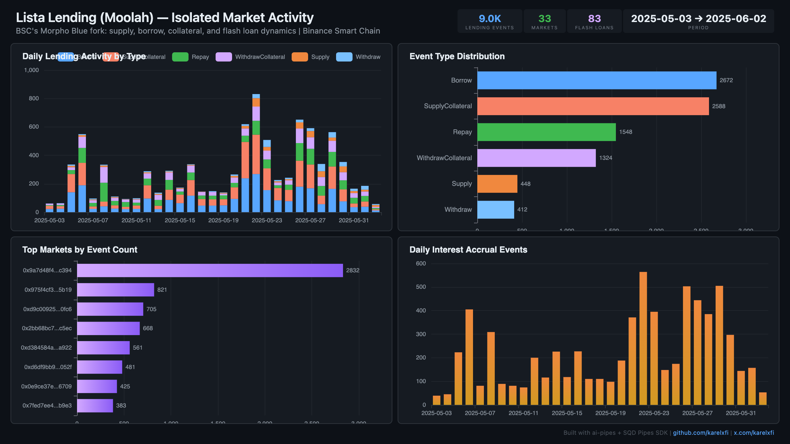

# Lista Lending (Moolah) — Isolated Market Activity



Track lending, borrowing, collateral, flash loans, and interest accruals across 33 isolated markets on BSC's Morpho Blue fork.

## Run

```bash
docker compose up -d
npm install
npm start
```

## Validate

```bash
npx tsx validate.ts
```

### Verification Report

```
=== Phase 1: Structural Checks ===

PASS: moolah_events: 8992 rows
PASS: moolah_interest: 6879 rows
PASS: moolah_flash_loans: 83 rows
PASS: Block range: 49,002,093 → 50,748,844
PASS: Timestamp range: 2025-05-03 04:23:22.000 → 2025-06-02 12:25:45.000
PASS: Event types: Borrow=2672, SupplyCollateral=2588, Repay=1548, WithdrawCollateral=1324, Supply=448, Withdraw=412
PASS: Unique markets: 33

=== Phase 2: Portal Cross-Reference ===

PASS: Portal cross-ref (Supply): CH=0, Portal=0 (0.0% diff) — blocks 49526118-49536118

=== Phase 3: Transaction Spot-Checks ===

PASS: Spot-check block 50747102 — tx 0x8179080c... market 0x975f4cf3... matches Portal
PASS: Spot-check block 50744754 — tx 0xa373f962... market 0x975f4cf3... matches Portal
PASS: Spot-check block 50744538 — tx 0x7fd728a6... market 0x975f4cf3... matches Portal

=== Results: 11 passed, 0 failed ===
```

## Dashboard

Open `dashboard/index.html` in your browser after the indexer has synced.

## Sample Query

```sql
SELECT
    event_type,
    count() as events,
    count(DISTINCT market_id) as markets
FROM lista_lending.moolah_events
GROUP BY event_type
ORDER BY events DESC
```
