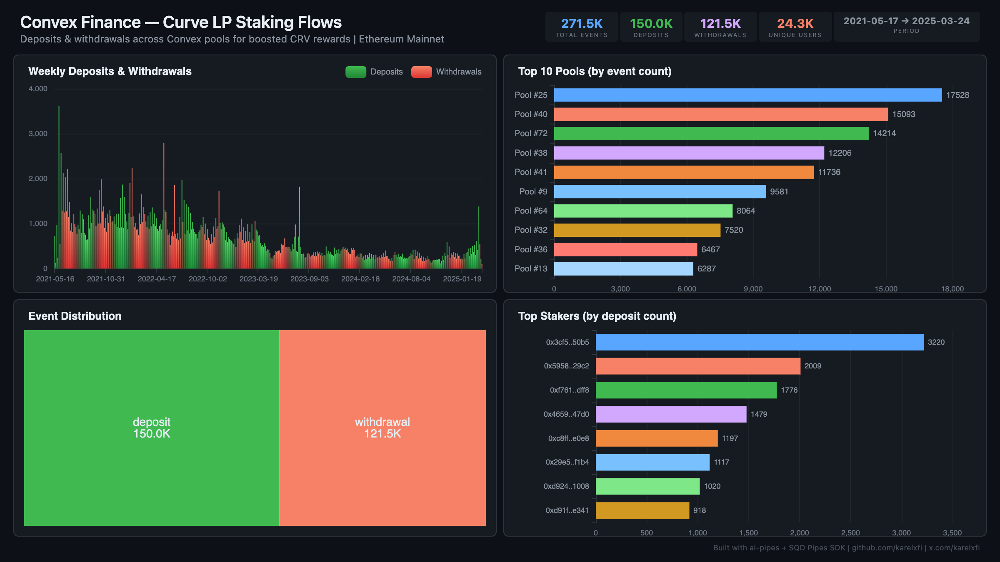

# Convex Finance — Curve LP Staking Flows



Track deposits and withdrawals across Convex Booster pools for boosted CRV rewards on Ethereum mainnet. 4 years of DeFi yield history.

## Verification Report

```
=== Convex Finance Curve LP Staking — Validation ===

── Phase 1: Structural Checks ──
PASS: Row count: 269045
PASS: Schema OK: all 6 required columns present
  withdrawal: 120755 events
  deposit: 148290 events
PASS: Both deposit and withdrawal event types indexed
PASS: Timestamp range: 2021-05-17 12:27:00 to 2025-03-14 04:23:23
PASS: 418 unique pools

── Phase 2: Portal Cross-Reference ──
PASS: Portal cross-ref — blocks 17247292-17257292: ClickHouse=179, Portal=179 (0.0% diff)

── Phase 3: Transaction Spot-Checks ──
PASS: Spot-check tx 0x054758d6... — block 22054506, pool #402 deposit confirmed
PASS: Spot-check tx 0x0e304aab... — block 22054503, pool #357 deposit confirmed
PASS: Spot-check tx 0x732be20c... — block 22054453, pool #40 deposit confirmed

=== SUMMARY: 9 passed, 0 failed ===
```

## Run

```bash
docker compose up -d
npm install
npm start
```

## Dashboard

Open `dashboard/index.html` in your browser after the indexer has synced.

## Sample Query

```sql
SELECT pool_id, event_type, count() as events
FROM convex.convex_staking
GROUP BY pool_id, event_type
ORDER BY events DESC
LIMIT 10
```

## Contract Indexed

| Contract | Address | Notes |
|----------|---------|-------|
| Convex Booster | `0xF403C135812408BFbE8713b5A23a04b3D48AAE31` | NOT a proxy — direct contract |
