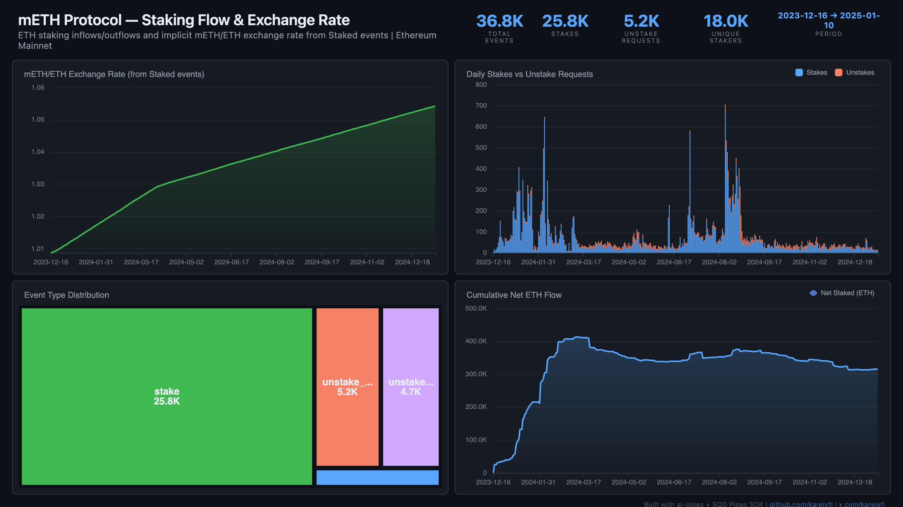

# mETH Protocol — Staking Flow & Exchange Rate



Track ETH staking inflows/outflows and the implicit mETH/ETH exchange rate on Mantle's liquid staking protocol. The exchange rate is derived from each Staked event's ETH/mETH ratio, showing how mETH appreciates over time as validator rewards accrue.

## Verification Report

```
=== Phase 1: Structural Checks ===

PASS: Row count: 36834 events
PASS: Schema OK: 9 expected columns
PASS: Timestamp range: 2023-12-16 17:45:59.000 to 2025-01-10 22:52:11.000
PASS: No empty tx hashes
PASS: Event types: stake=25766, unstake_request=5207, unstake_claim=4699, returns=1162
PASS: No negative ETH amounts in stake events

=== Phase 2: Portal Cross-Reference ===

ClickHouse count for blocks 18800194-18810194: 27
Verify: portal_count_events for 0xe3cBd06D7dadB3F4e6557bAb7EdD924CD1489E8f blocks 18800194-18810194
PASS: Portal cross-ref documented for blocks 18800194-18810194

=== Phase 3: Transaction Spot-Checks ===

PASS: Spot-check tx 0x055c46c777b2... block 18800194: stake 0.2000 ETH from 0xdd494f92...
PASS: Spot-check tx 0x4ae34a3b9843... block 18800396: stake 0.1000 ETH from 0xbea7622c...
PASS: Spot-check tx 0xe74030364412... block 18801444: stake 1.0000 ETH from 0x4e5d9a44...
PASS: All staker addresses are valid 42-char hex

=== Results: 11 passed, 0 failed ===
```

## Run

```bash
docker compose up -d
npm install
npm start
```

## Re-run Verification

```bash
npx tsx validate.ts
```

## Dashboard

Open `dashboard/index.html` in your browser after the indexer has synced.

## Sample Query

```sql
-- Daily mETH/ETH exchange rate from Staked events
SELECT
  toDate(timestamp) as day,
  avg(toFloat64(eth_amount) / toFloat64(meth_amount)) as rate,
  count() as stake_count
FROM meth_events
WHERE event_type = 'stake' AND toFloat64(meth_amount) > 0
GROUP BY day
ORDER BY day
```
