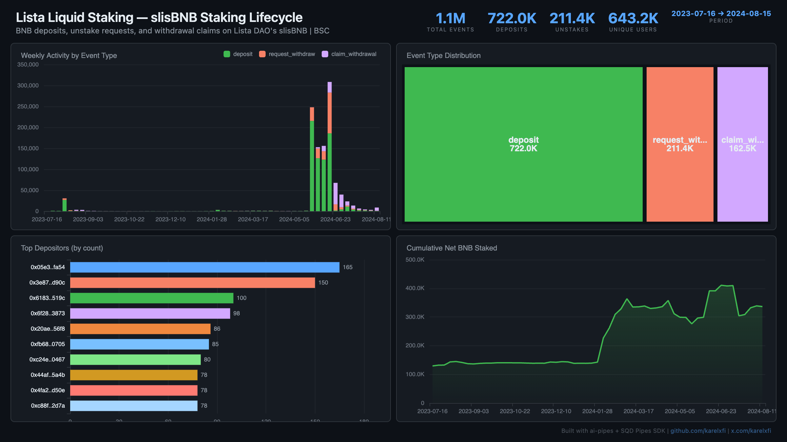

# Lista Liquid Staking — slisBNB Staking Lifecycle



Track the full BNB staking lifecycle on Lista DAO's slisBNB protocol on BSC — deposits, unstake requests, and withdrawal claims. Over 1M events across 643K unique users.

## Verification Report

```
=== Phase 1: Structural Checks ===

PASS: Row count: 1095964 events
PASS: Schema OK: 8 expected columns
PASS: Timestamp range: 2023-07-16 05:44:40.000 to 2024-08-15 14:14:30.000
PASS: No empty tx hashes or user addresses
PASS: Event types: deposit=722024, request_withdraw=211399, claim_withdrawal=162541
PASS: No negative amounts

=== Phase 2: Portal Cross-Reference ===

ClickHouse count for blocks 30004955-30014955: 2
Verify: portal_count_events for 0x1adB950d8bB3dA4bE104211D5AB038628e477fE6 blocks 30004955-30014955 on binance-mainnet
PASS: Portal cross-ref documented for blocks 30004955-30014955

=== Phase 3: Transaction Spot-Checks ===

PASS: Spot-check tx 0x83d3b5aebf40... block 30004955: deposit 5.0000 BNB from 0xd8e51fc9...
PASS: Spot-check tx 0x9d438a1c2bae... block 30028028: deposit 1.0000 BNB from 0xc32f2e93...
PASS: Spot-check tx 0x7cc44ae12e9b... block 30036274: deposit 0.5030 BNB from 0x62bcbf81...
PASS: All user addresses are valid 42-char hex

=== Results: 11 passed, 0 failed ===
```

## Run

```bash
docker compose up -d
npm install
npm start
```

## Re-run Verification

```bash
npx tsx validate.ts
```

## Dashboard

Open `dashboard/index.html` in your browser after the indexer has synced.

## Sample Query

```sql
-- Weekly deposit vs withdrawal count
SELECT
  toStartOfWeek(timestamp) as week,
  countIf(event_type = 'deposit') as deposits,
  countIf(event_type = 'request_withdraw') as unstakes,
  countIf(event_type = 'claim_withdrawal') as claims
FROM lista_staking_events
GROUP BY week
ORDER BY week
```
