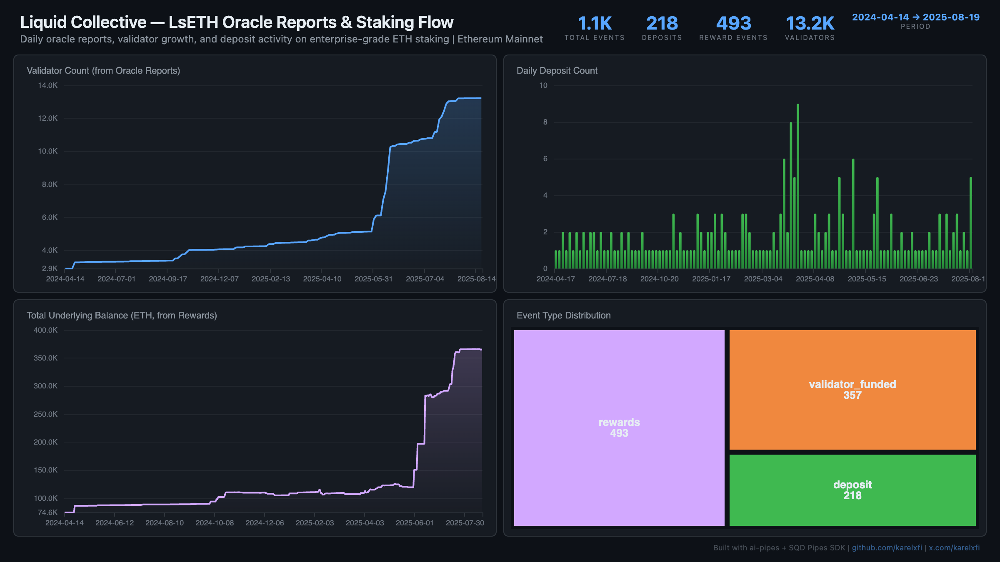

# Liquid Collective — LsETH Validator Growth & Staking Flow



Track validator growth, deposit flow, and reward accumulation on Liquid Collective's enterprise-grade ETH staking protocol. Backed by Coinbase, Figment, and Kiln — low event volume but massive per-deposit values (one deposit was 10,756 ETH).

## Verification Report

```
=== Phase 1: Structural Checks ===

PASS: Row count: 1068 events
PASS: Schema OK: 9 expected columns present
PASS: Timestamp range: 2024-04-14 12:15:59.000 to 2025-08-19 12:14:59.000
PASS: No empty tx hashes
PASS: Event types: rewards=493, validator_funded=357, deposit=218
PASS: Validator funded events: 357

=== Phase 2: Portal Cross-Reference ===

ClickHouse count for blocks 19653711-19663711: 3
Verify: portal_count_events for 0x8c1BEd5b9a0928467c9B1341Da1D7BD5e10b6549 blocks 19653711-19663711
PASS: Portal cross-ref documented for blocks 19653711-19663711

=== Phase 3: Transaction Spot-Checks ===

PASS: Spot-check tx 0x865821f333e9... block 19676297: deposit 17.5255 ETH from 0x64a57c29...
PASS: Spot-check tx 0xf65c39ae1a40... block 19735306: deposit 1000.0000 ETH from 0xf594707c...
PASS: Spot-check tx 0x64583f950049... block 19736418: deposit 10756.2674 ETH from 0x64a57c29...
PASS: Validator count is monotonically non-decreasing in oracle reports

=== Results: 11 passed, 0 failed ===
```

## Run

```bash
docker compose up -d
npm install
npm start
```

## Re-run Verification

```bash
npx tsx validate.ts
```

## Dashboard

Open `dashboard/index.html` in your browser after the indexer has synced.

## Sample Query

```sql
-- Validator count growth over time
SELECT
  toDate(timestamp) as day,
  max(validator_count) as validators
FROM lc_events
WHERE event_type = 'validator_funded'
GROUP BY day
ORDER BY day
```
