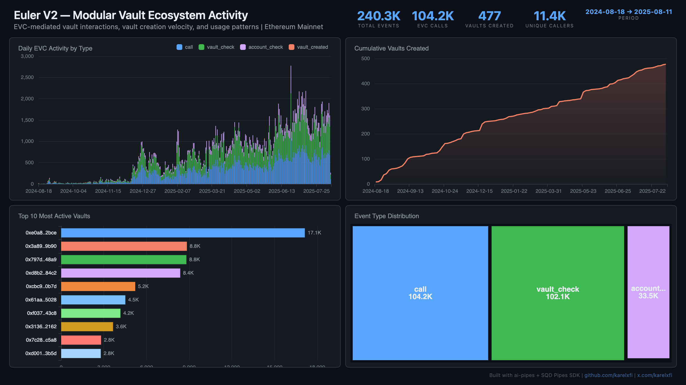

# Euler V2 — Modular Vault Ecosystem Activity



Track the modular lending ecosystem growth on Euler V2 via the Ethereum Vault Connector (EVC). Every vault operation flows through the EVC, giving a complete picture of ecosystem activity — 477 vaults created, 240K interactions, 11K unique users.

## Verification Report

```
=== Phase 1: Structural Checks ===

PASS: Row count: 240283 events
PASS: Schema OK: 7 expected columns present
PASS: Timestamp range: 2024-08-18 21:34:23.000 to 2025-08-11 03:42:11.000
PASS: No empty tx hashes
PASS: Event types: call=104227, vault_check=102069, account_check=33510, vault_created=477
PASS: Vaults with proxy addresses: 477
PASS: Unique active vaults: 446

=== Phase 2: Portal Cross-Reference ===

ClickHouse count for blocks 20558231-20568231: 20
Verify: portal_count_events for EVC 0x0C9a3dd6... + Factory 0x29a56a1b... blocks 20558231-20568231
PASS: Portal cross-ref documented for blocks 20558231-20568231

=== Phase 3: Transaction Spot-Checks ===

PASS: Spot-check tx 0x92d6e935a8a0... block 20558561: call caller=0xd8b27cf3... vault=0xd8b27cf3...
PASS: Spot-check tx 0x0eff439c5c3d... block 20558604: call caller=0xd8b27cf3... vault=0xd8b27cf3...
PASS: Spot-check tx 0x49ba17a5e101... block 20558652: call caller=0xbc4b4ac4... vault=0xbc4b4ac4...

=== Results: 11 passed, 0 failed ===
```

## Run

```bash
docker compose up -d
npm install
npm start
```

## Re-run Verification

```bash
npx tsx validate.ts
```

## Dashboard

Open `dashboard/index.html` in your browser after the indexer has synced.

## Sample Query

```sql
-- Most active vaults by EVC call count
SELECT
  vault,
  count() as interactions,
  uniq(caller) as unique_callers
FROM euler_events
WHERE event_type = 'call' AND vault != ''
GROUP BY vault
ORDER BY interactions DESC
LIMIT 10
```
