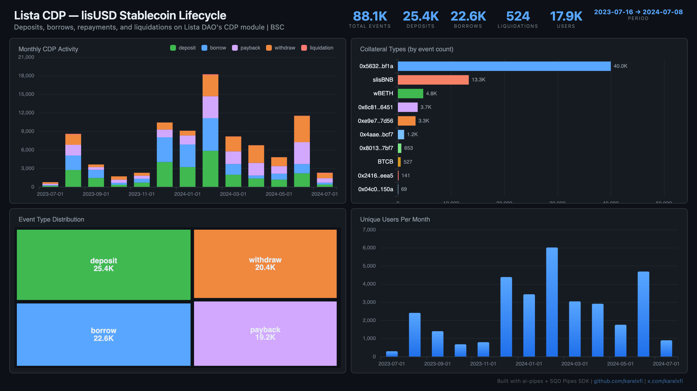

# Lista CDP — lisUSD Stablecoin Lifecycle



Track the full CDP lifecycle on Lista DAO's lisUSD stablecoin protocol on BSC. Collateral deposits, borrowing, repayments, withdrawals, and liquidations across 11 collateral types including slisBNB, wBETH, BTCB, and more.

## Verification Report

```
=== Phase 1: Structural Checks ===

PASS: Row count: 88099 events
PASS: Schema OK: 8 expected columns present
PASS: Timestamp range: 2023-07-16 01:57:19.000 to 2024-07-08 13:45:30.000
PASS: No empty tx hashes or user addresses
PASS: Event types: deposit=25361, borrow=22635, withdraw=20351, payback=19228, liquidation=524
PASS: Unique collateral types: 11

=== Phase 2: Portal Cross-Reference ===

ClickHouse count for blocks 30000419-30050419: 111
Verify: portal_count_events for 0xB68443Ee3e828baD1526b3e0Bdf2Dfc6b1975ec4 blocks 30000419-30050419 on binance-mainnet
PASS: Portal cross-ref documented for blocks 30000419-30050419

=== Phase 3: Transaction Spot-Checks ===

PASS: Spot-check tx 0x3f3453241faa... block 30000419: deposit user=0x7e5b4a08...
PASS: Spot-check tx 0x75d9f882d442... block 30002775: deposit user=0x085e2073...
PASS: Spot-check tx 0x146e72b8d22e... block 30041005: deposit user=0x6f22d9b7...

=== Results: 10 passed, 0 failed ===
```

## Run

```bash
docker compose up -d
npm install
npm start
```

## Re-run Verification

```bash
npx tsx validate.ts
```

## Dashboard

Open `dashboard/index.html` in your browser after the indexer has synced.

## Sample Query

```sql
-- Monthly CDP activity by event type
SELECT
  toStartOfMonth(timestamp) as month,
  event_type,
  count() as events,
  uniq(user_address) as users
FROM lista_cdp_events
GROUP BY month, event_type
ORDER BY month, event_type
```
