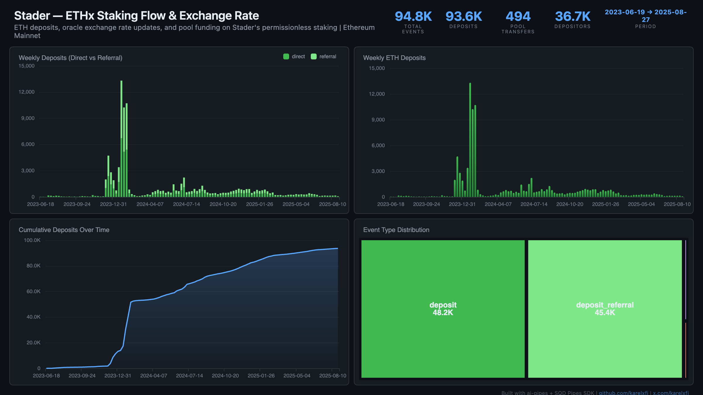

# Stader — ETHx Staking Flow



Track ETH deposits on Stader's permissionless ETHx liquid staking protocol. 94.8K events across 36.7K depositors, with ~50/50 split between direct and referral deposits showing the impact of Stader's referral program.

## Verification Report

```
=== Phase 1: Structural Checks ===

PASS: Row count: 94811 events
PASS: Schema OK: 8 expected columns present
PASS: Timestamp range: 2023-06-19 13:31:11.000 to 2025-08-27 21:58:11.000
PASS: No empty tx hashes
PASS: Event types: deposit=48192, deposit_referral=45428, eth_to_withdraw=697, eth_to_pool=494
PASS: Unique depositors: 36669

=== Phase 2: Portal Cross-Reference ===

ClickHouse count for blocks 17514103-17524103: 18
Verify: portal_count_events for 0xcf5EA1b38380f6aF39068375516Daf40Ed70D299 blocks 17514103-17524103
PASS: Portal cross-ref documented for blocks 17514103-17524103

=== Phase 3: Transaction Spot-Checks ===

PASS: Spot-check tx 0xae4d1d1379be... block 17514103: deposit 0.0100 ETH from 0xd6cd6404...
PASS: Spot-check tx 0xf67ae97dec9b... block 17514790: deposit 0.0010 ETH from 0xc118488e...
PASS: Spot-check tx 0xe13117831f56... block 17514815: deposit 0.0001 ETH from 0xdc1e19e1...

=== Results: 10 passed, 0 failed ===
```

## Run

```bash
docker compose up -d
npm install
npm start
```

## Sample Query

```sql
-- Weekly direct vs referral deposits
SELECT
  toStartOfWeek(timestamp) as week,
  countIf(event_type = 'deposit') as direct,
  countIf(event_type = 'deposit_referral') as referral
FROM stader_events
GROUP BY week
ORDER BY week
```
