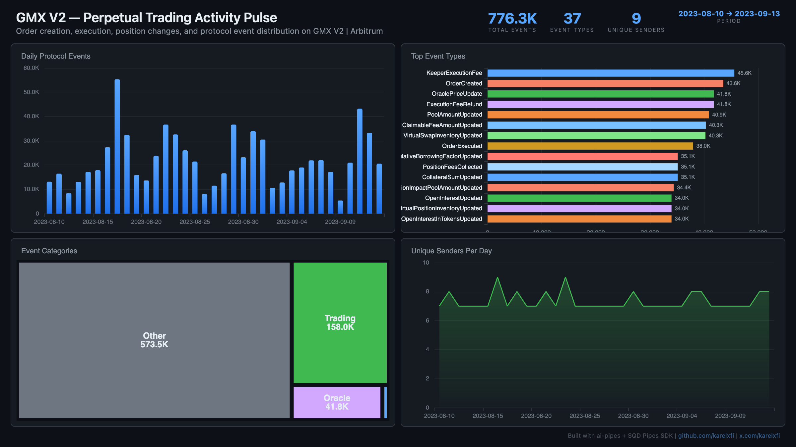

# GMX V2 — Perpetual Trading Activity Pulse



Track perpetual trading activity on GMX V2 via the centralized EventEmitter pattern on Arbitrum. GMX V2 routes ALL protocol events through a single contract — 776K events across 37 event types showing orders, executions, positions, oracle updates, and fee collection.

## Verification Report

```
=== Phase 1: Structural Checks ===

PASS: Row count: 776298 events
PASS: Schema OK: 7 expected columns present
PASS: Timestamp range: 2023-08-10 10:19:21.000 to 2023-09-13 19:02:52.000
PASS: No empty tx hashes or event names
PASS: Top event types: KeeperExecutionFee=45597, OrderCreated=43555, OraclePriceUpdate=41811, ExecutionFeeRefund=41798, PoolAmountUpdated=40902, ...
PASS: Unique event names: 37
PASS: Unique senders: 9

=== Phase 2: Portal Cross-Reference ===

ClickHouse count for blocks 120000319-120010319: 844
Verify: portal_count_events for 0xC8ee91A54287DB53897056e12D9819156D3822Fb blocks 120000319-120010319 on arbitrum-one
PASS: Portal cross-ref documented for blocks 120000319-120010319

=== Phase 3: Transaction Spot-Checks ===

PASS: Spot-check tx 0xd5d4c308e33a... block 120000319: OrderCreated from 0x51e210dc...
PASS: Spot-check tx 0x22acc3ae392d... block 120000341: OrderCreated from 0x51e210dc...
PASS: Spot-check tx 0x0750c263e1fc... block 120000359: CumulativeBorrowingFactorUpdated from 0x51e210dc...

=== Results: 11 passed, 0 failed ===
```

## Run

```bash
docker compose up -d
npm install
npm start
```

## Dashboard

Open `dashboard/index.html` in your browser after the indexer has synced.

## Sample Query

```sql
-- Top event types by count
SELECT
  event_name,
  count() as events,
  round(count() * 100.0 / sum(count()) OVER (), 2) as pct
FROM gmx_events
GROUP BY event_name
ORDER BY events DESC
LIMIT 15
```
