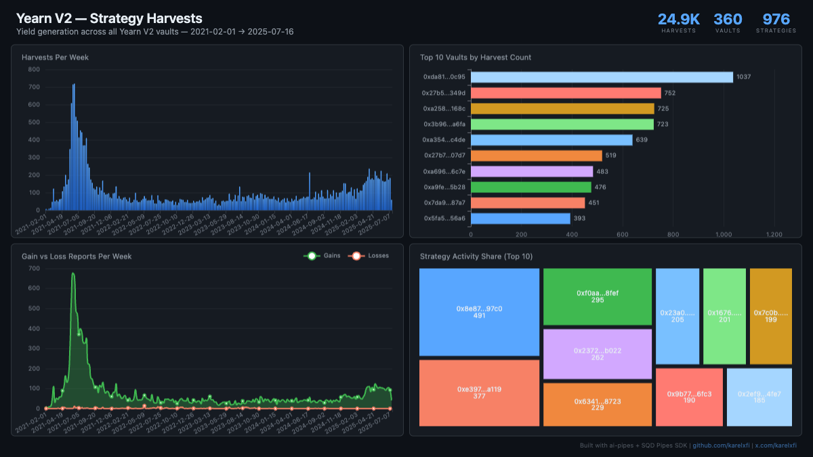

# Yearn V2 — Strategy Harvests

Track `StrategyReported` events across ALL Yearn V2 vaults on Ethereum mainnet. This event fires every time a strategy reports gains/losses back to its vault — the heartbeat of Yearn's yield generation.



## Verification Report

```
============================================================
Validating yearn_v2.yearn_v2_strategy_reported
============================================================

--- Phase 1: Structural Checks ---
PASS: Table has rows (found 24858)
PASS: Column 'vault' exists
PASS: Column 'strategy' exists
PASS: Column 'gain' exists
PASS: Column 'loss' exists
PASS: Column 'debt_paid' exists
PASS: Column 'total_gain' exists
PASS: Column 'total_loss' exists
PASS: Column 'total_debt' exists
PASS: Column 'debt_added' exists
PASS: Column 'debt_ratio' exists
PASS: Column 'block_number' exists
PASS: Column 'tx_hash' exists
PASS: Column 'log_index' exists
PASS: Column 'timestamp' exists
PASS: Column 'sign' exists
PASS: Min timestamp is 2020+ (got 2021-02-01T21:06:39.000Z)
PASS: Time range spans multiple dates (2021-02-01 to 2025-07-16)
PASS: No empty addresses
PASS: Multiple vaults tracked (found 360)
PASS: Multiple strategies tracked (found 976)
PASS: Min block >= 11000000 (got 11772924)

--- Phase 2: Portal Cross-Reference ---
PASS: Portal cross-ref (blocks 17351751-17361751) — ClickHouse: 5, Portal: 5 (exact match)

--- Phase 3: Transaction Spot-Checks ---
PASS: Spot-check tx 0x6b4df7e0... block 11772924 — vault, event sig, strategy all match Portal
PASS: Spot-check tx 0x78e18075... block 11779157 — vault, event sig, strategy all match Portal
PASS: Spot-check tx 0xf3a55401... block 11782347 — vault, event sig, strategy all match Portal

============================================================
Results: 26 passed, 0 failed
============================================================
```

All 26 checks pass: structural validation (schema, row counts, timestamps, addresses), Portal cross-reference (exact match on event count in sample block range), and transaction spot-checks (field-level verification against Portal for 3 transactions).

## Run

```bash
docker compose up -d
npm install
npm start
```

## Re-run verification

```bash
npx tsx validate.ts
```

## View dashboard

Open `dashboard/index.html` in a browser (ClickHouse must be running on localhost:8123).

## Sample ClickHouse query

```sql
-- Top 10 vaults by harvest count
SELECT
  vault,
  count() as harvests,
  countIf(toUInt256(gain) > 0) as gain_reports,
  countIf(toUInt256(loss) > 0) as loss_reports
FROM yearn_v2.yearn_v2_strategy_reported
GROUP BY vault
ORDER BY harvests DESC
LIMIT 10
```

Expected output shape:
```
┌─vault──────────────────────────────────────────┬─harvests─┬─gain_reports─┬─loss_reports─┐
│ 0xdA816459F1AB5631232FE5e97a05BBBb94970c95     │     1037 │          982 │           55 │
│ 0x27b5739e22ad9033bcBf192059122d163b60349D     │      752 │          701 │           51 │
│ ...                                            │          │              │              │
└────────────────────────────────────────────────┴──────────┴──────────────┴──────────────┘
```
