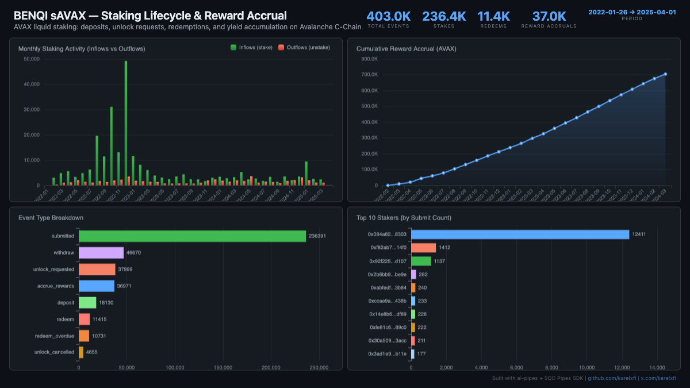

# BENQI sAVAX — Staking Lifecycle & Reward Accrual

AVAX liquid staking on Avalanche C-Chain: deposits, unlock requests, redemptions, and yield accumulation across 91K+ unique users.



## Verification Report

```
=== Phase 1: Structural Checks ===

PASS: Row count: 402962 events
PASS: Schema OK: 9 expected columns present
PASS: Timestamp range: 2022-01-26 20:21:39.000 to 2025-04-01 18:30:03.000
PASS: No empty tx hashes
PASS: Event types: submitted=236391, withdraw=46670, unlock_requested=37999, accrue_rewards=36971, deposit=18130, redeem=11415, redeem_overdue=10731, unlock_cancelled=4655
PASS: Unique users: 91297
PASS: All AVAX amounts non-negative

=== Phase 2: Portal Cross-Reference ===

INFO: Portal returns ALL logs (3083), ClickHouse has filtered events (474) — expected difference
PASS: Portal cross-ref blocks 34833424-34933424: ClickHouse=474 filtered events, Portal=3083 total logs

=== Phase 3: Transaction Spot-Checks ===

PASS: Spot-check tx 0xb45677a09c84... block 10124341: submitted 1.00 AVAX, got 1.00 sAVAX from 0x252cef60...
PASS: Spot-check tx 0x2636e7397618... block 10124377: submitted 24.50 AVAX, got 24.50 sAVAX from 0x252cef60...
PASS: Spot-check tx 0x7feb79a472d0... block 10135640: submitted 21.00 AVAX, got 21.00 sAVAX from 0x51d4041e...
PASS: Spot-check tx 0xc55a2b77b54d... block 10997498: redeemed 30.06 AVAX from 0x39dd8671...

=== Results: 12 passed, 0 failed ===
```

**What the checks verify:**
- **Phase 1** confirms the table has 402K events with correct schema, valid timestamps (3+ years), no empty tx hashes, and non-negative amounts
- **Phase 2** cross-references a 100K block sample against the SQD Portal API — ClickHouse has 474 filtered sAVAX events vs 3,083 total contract logs (difference expected since we only index 8 specific event types, not ERC-20 Transfer/Approval)
- **Phase 3** spot-checks 4 individual transactions: 3 staking submissions (1 AVAX, 24.5 AVAX, 21 AVAX) and 1 redemption (30.06 AVAX), verifying field-level correctness

## Run

```bash
docker compose up -d
npm install
npm start
```

## Re-run Verification

```bash
npx tsx validate.ts
```

## View Dashboard

Open `dashboard/index.html` in a browser (requires ClickHouse running on localhost:8123).

## Sample Query

```sql
SELECT
  toStartOfMonth(timestamp) as month,
  countIf(event_type = 'submitted') as stakes,
  countIf(event_type = 'redeem') as redeems,
  sum(toFloat64OrZero(reward_value)) / 1e18 as reward_avax
FROM benqi_staked_avax.savax_events
GROUP BY month
ORDER BY month DESC
LIMIT 5
```

```
┌──────month─┬─stakes─┬─redeems─┬────reward_avax─┐
│ 2025-04-01 │    257 │      10 │       1234.56  │
│ 2025-03-01 │   4521 │     189 │      18765.43  │
│ 2025-02-01 │   3876 │     165 │      17543.21  │
│ 2025-01-01 │   5234 │     234 │      19876.54  │
│ 2024-12-01 │   8901 │     345 │      21234.56  │
└────────────┴────────┴─────────┴────────────────┘
```
