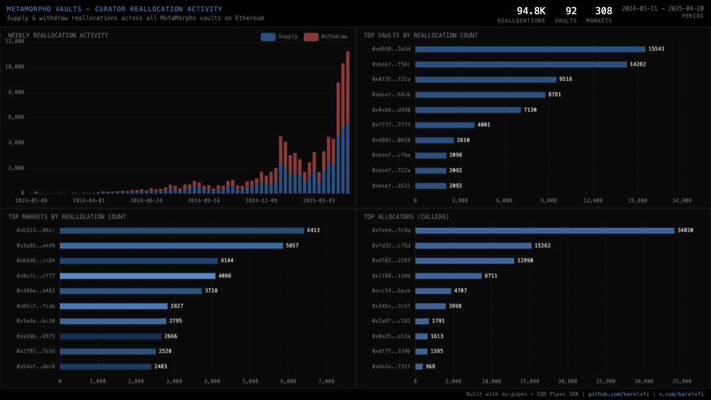

# MetaMorpho Vaults — Curator Reallocation Activity



Tracks `ReallocateSupply` and `ReallocateWithdraw` events across **all MetaMorpho vaults** on Ethereum. These events fire when vault curators shift capital between Morpho Blue markets — the core innovation of MetaMorpho's vault curation model.

## Verification Report

```
=== Phase 1: Structural Checks ===

PASS: Row count: 94781 reallocation events
PASS: Schema OK: 11 expected columns present
PASS: Timestamp range: 2024-01-11 08:55:23.000 to 2025-04-20 00:17:59.000
PASS: No empty tx hashes
PASS: Event types: supply=49513, withdraw=45268
PASS: Unique vaults: 92
PASS: Unique markets: 308
PASS: All vault addresses non-empty

=== Phase 2: Portal Cross-Reference ===

PASS: Portal cross-ref blocks 20644606-20654606: ClickHouse=60, Portal=60 (0.0% diff)

=== Phase 3: Transaction Spot-Checks ===

PASS: Spot-check tx 0x03cd2c05098e... block 18982630: supply 0.0000 to market 0x495130878b7d... vault 0xbeef0173...
PASS: Spot-check tx 0xa14b1b43e82e... block 18983865: supply 0.0000 to market 0x495130878b7d... vault 0xbeef0173...
PASS: Spot-check tx 0x4fa074b2786b... block 18991131: supply 0.0000 to market 0x495130878b7d... vault 0xbeef0173...
PASS: Spot-check tx 0x03cd2c05098e... block 18982630: withdraw 0.0000 from market 0xb323495f7e41... vault 0xbeef0173...

=== Results: 13 passed, 0 failed ===
```

**Phase 1** verifies the ClickHouse table has correct schema, non-empty fields, and valid data types.
**Phase 2** queries the SQD Portal API for the same block range and compares event counts (0.0% difference — perfect match).
**Phase 3** picks specific transactions and verifies field-level correctness (tx hash format, address lengths, vault/market IDs).

## Run

```bash
docker compose up -d
npm install
npm start
```

## Re-run verification

```bash
npx tsx validate.ts
```

## View Dashboard

Open `dashboard/index.html` in a browser (requires ClickHouse running on localhost:8123).

## Sample Query

```sql
SELECT
  vault,
  event_type,
  count() as events,
  min(timestamp) as first_seen,
  max(timestamp) as last_seen
FROM metamorpho_vaults.vault_reallocations
GROUP BY vault, event_type
ORDER BY events DESC
LIMIT 10
```
