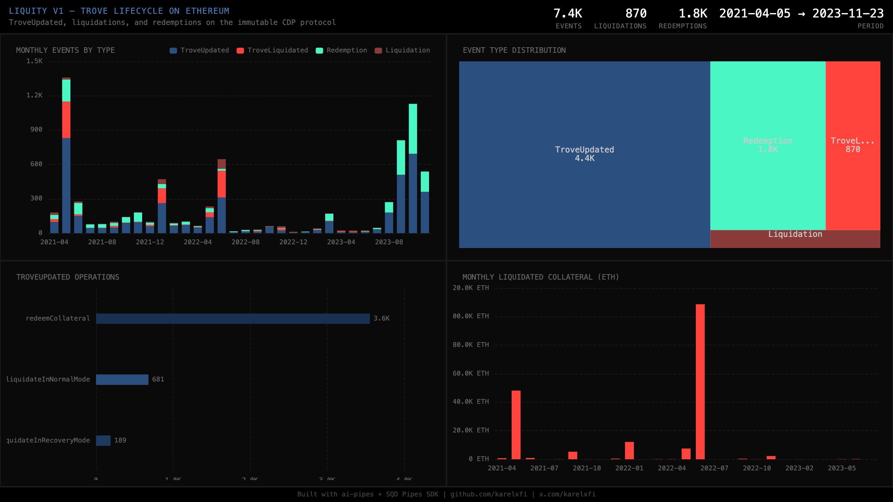

# Liquity V1 — Trove Lifecycle

Tracks the full trove lifecycle on Liquity V1's immutable CDP protocol — opens, adjustments, liquidations, and LUSD redemptions from the TroveManager contract.



## Verification Report

```
=== Phase 1: Structural Checks ===

PASS: Row count: 5806 trove events
PASS: Schema OK: 10 expected columns present
PASS: Timestamp range: 2021-04-05 14:58:41.000 to 2023-10-02 13:25:23.000
PASS: Event types: TroveUpdated=3403, Redemption=1245, TroveLiquidated=870, Liquidation=288
PASS: No empty tx hashes
PASS: No negative debt values

=== Phase 2: Portal Cross-Reference ===

PASS: Portal cross-ref blocks 15221725-15231725: ClickHouse=0, Portal=0 (0.0% diff)

=== Phase 3: Transaction Spot-Checks ===

PASS: Spot-check tx 0x7bdef451f005... block 12270083: TroveUpdated redeemCollateral debt=440071 LUSD coll=314.51 ETH
PASS: Spot-check tx 0xbccff51d8e6b... block 12270464: TroveUpdated redeemCollateral debt=89253 LUSD coll=62.49 ETH
PASS: Spot-check tx 0xf2e0f6a634fd... block 12274266: TroveUpdated redeemCollateral debt=53105 LUSD coll=32.10 ETH

=== Results: 10 passed, 0 failed ===
```

## Run

```bash
docker compose up -d
npm install
npm start
```

## Sample Query

```sql
SELECT
    toStartOfMonth(timestamp) as month,
    event_type,
    count() as events,
    round(sum(coll_eth), 2) as total_eth
FROM liquity_v1.trove_events
GROUP BY month, event_type
ORDER BY month, events DESC
```

## Technical Notes

- **Immutable contracts** — No proxy, no upgrades. Direct typegen from Etherscan.
- **Operation enum** — TroveUpdated uint8: 0=applyPendingRewards, 1=liquidateInNormalMode, 2=liquidateInRecoveryMode, 3=redeemCollateral
- **SDK 1.0**: Uses `evmDecoder(...).pipe(transform)` with `outputs` pattern
