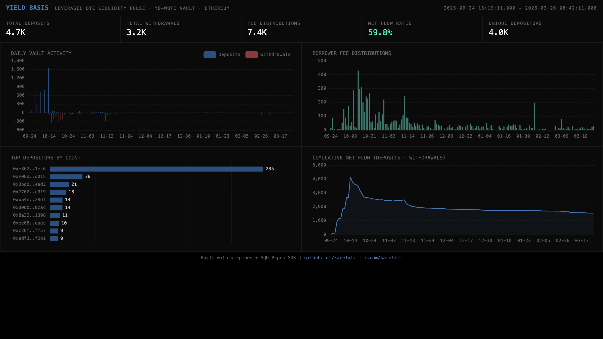

# 045 — Yield Basis: Leveraged BTC Liquidity Pulse



## Overview

Tracks the **yb-WBTC vault** on Yield Basis — a 2x leveraged BTC liquidity protocol built on Curve Finance. The indexer captures vault deposits/withdrawals and the leverage mechanism (borrower fee distributions, stablecoin allocations).

**Contract:** `0x6095a220c5567360d459462a25b1ad5aead45204` (yb-WBTC LT vault)
**Chain:** Ethereum Mainnet
**Start block:** 23,434,006 (Sep 2025)

## Verification Report

```
=== Yield Basis yb-WBTC Vault Validation ===

--- Phase 1: Structural Checks ---
PASS: Structural - vault_events has 7862 rows
PASS: Structural - leverage_ops has 7724 rows
PASS: Structural - vault_events schema OK
PASS: Structural - leverage_ops schema OK
PASS: Structural - timestamps 2025-09-24 16:19:11.000 to 2026-03-26 08:42:11.000
PASS: Structural - both deposit and withdraw events present
PASS: Structural - borrower fee distribution events present

--- Phase 2: Portal Cross-Reference ---
PASS: Portal cross-ref vault events (blocks 23434043-23439043) - ClickHouse: 25, Portal: 25 (0.0% diff)
PASS: Portal cross-ref leverage ops (blocks 23434043-23439043) - ClickHouse: 23, Portal: 23 (0.0% diff)

--- Phase 3: Transaction Spot-Checks ---
PASS: Spot-check tx 0x4b48ce3984... - block 23434043, contract matches
PASS: Spot-check fee tx 0x14d5b10928... - block 23434125, sender matches
PASS: Spot-check withdraw tx 0xfe2a7896f2... - block 24740609, found in Portal

=== Results: 12 passed, 0 failed ===
```

## Run

```bash
docker compose up -d
npm install
npm start
```

## Sample ClickHouse Query

```sql
-- Daily deposit/withdrawal counts
SELECT
  toDate(timestamp) as day,
  event_type,
  count() as events
FROM yield_basis.vault_events
GROUP BY day, event_type
ORDER BY day DESC
LIMIT 20;

-- Top depositors by count
SELECT sender, count() as deposits
FROM yield_basis.vault_events
WHERE event_type = 'deposit'
GROUP BY sender
ORDER BY deposits DESC
LIMIT 10;
```
