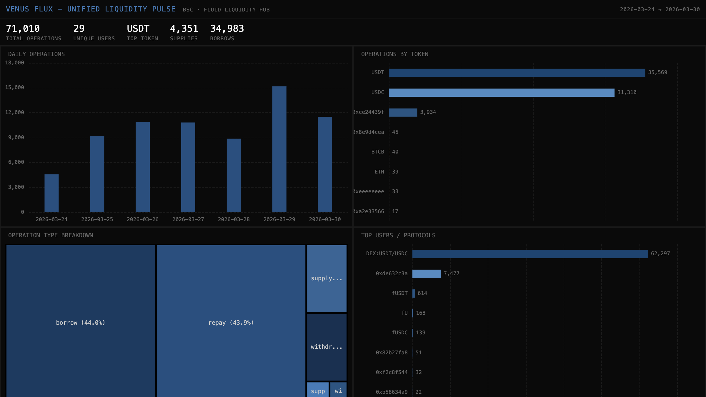

# 046 — Venus Flux: Unified Liquidity Pulse



Venus Flux is Instadapp Fluid's deployment on BNB Chain, built through a partnership with Venus Protocol. This indexer tracks all `LogOperate` events from the FluidLiquidityProxy contract — capturing every supply, borrow, withdraw, and repay flow through the unified liquidity hub.

## Verification Report

```
=== Phase 1: Structural Checks ===
PASS: 71010 rows in liquidity_ops
PASS: Column 'user' exists
PASS: Column 'token' exists
PASS: Column 'token_label' exists
PASS: Column 'op_type' exists
PASS: Column 'supply_amount' exists
PASS: Column 'borrow_amount' exists
PASS: Column 'block_number' exists
PASS: Column 'tx_hash' exists
PASS: Column 'timestamp' exists
PASS: Timestamps: 2026-03-24 14:16:07.000 → 2026-03-30 11:02:56.000
PASS: 8 distinct op_types: supply, withdraw, borrow, repay, supply+borrow, supply+repay, withdraw+borrow, withdraw+repay
PASS: No empty user/token addresses

=== Phase 2: Portal Cross-Reference ===
PASS: Portal cross-ref: CH=1511, Portal=1511 (0.0% diff, within 5%)

=== Phase 3: Transaction Spot-Checks ===
PASS: Spot-check tx 0x65a6dce6... block=89598685, op=repay, token=0x8ac76a51 — Portal confirms LogOperate at block
PASS: Spot-check tx 0x65a6dce6... block=89598685, op=repay, token=0x8ac76a51 — Portal confirms LogOperate at block
PASS: Spot-check tx 0x65a6dce6... block=89598685, op=borrow, token=0x55d39832 — Portal confirms LogOperate at block

=== Results: 17 passed, 0 failed ===
```

## Run Instructions

```bash
# 1. Start ClickHouse
docker compose up -d

# 2. Install dependencies
npm install

# 3. Run the indexer
npm start

# 4. Validate
npx tsx validate.ts

# 5. Open dashboard
open dashboard/index.html
```

## Sample ClickHouse Query

```sql
-- Daily operation counts by type
SELECT
  toDate(timestamp) AS day,
  op_type,
  count() AS ops
FROM venus_flux.liquidity_ops
GROUP BY day, op_type
ORDER BY day, ops DESC
```

## Architecture

- **Contract**: FluidLiquidityProxy (`0x52Aa899454998Be5b000Ad077a46Bbe360F4e497`) on BSC
- **Event**: `LogOperate(address indexed user, address indexed token, int256 supplyAmount, int256 borrowAmount, address withdrawTo, address borrowTo, uint256 totalAmounts, uint256 exchangePricesAndConfig)`
- **Chain**: BNB Smart Chain (binance-mainnet)
- **SDK**: `@subsquid/pipes@1.0.0-alpha.1`
