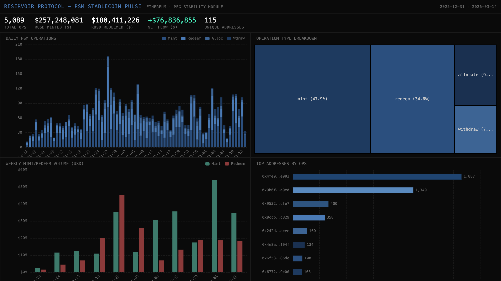

# 047 — Reservoir Protocol: PSM Stablecoin Pulse



Reservoir Protocol is a CDP protocol on Ethereum issuing rUSD stablecoin via Peg Stability Modules. This indexer tracks Mint, Redeem, Allocate, and Withdraw events across all three PSMs (USDC, USDT, USD1) to monitor the full lifecycle of rUSD flows.

## Verification Report

```
=== Phase 1: Structural Checks ===
PASS: 5089 rows in psm_ops
PASS: Column 'event_type' exists
PASS: Column 'psm_label' exists
PASS: Column 'amount' exists
PASS: Column 'amount_usd' exists
PASS: Column 'block_number' exists
PASS: Column 'tx_hash' exists
PASS: Column 'timestamp' exists
PASS: Timestamps: 2025-12-31 16:13:23.000 → 2026-03-14 13:38:35.000
PASS: 4 distinct event_types: mint, redeem, allocate, withdraw
PASS: No negative amount_usd values

=== Phase 2: Portal Cross-Reference ===
PASS: Portal cross-ref: CH=27, Portal=27 (0.0% diff, within 5%)

=== Phase 3: Transaction Spot-Checks ===
PASS: Spot-check tx 0x40308ff4... block=24656073, type=mint, psm=PSM:USDC, $2000 — Portal confirms
PASS: Spot-check tx 0x822d1231... block=24655942, type=withdraw, psm=PSM:USDC, $182111 — Portal confirms
PASS: Spot-check tx 0xdfa2a7b9... block=24655932, type=withdraw, psm=PSM:USDC, $6000000 — Portal confirms

=== Results: 15 passed, 0 failed ===
```

## Run Instructions

```bash
# 1. Start ClickHouse
docker compose up -d

# 2. Install dependencies
npm install

# 3. Run the indexer (90-day lookback)
npm start

# 4. Validate
npx tsx validate.ts

# 5. Open dashboard
open dashboard/index.html
```

## Sample ClickHouse Query

```sql
-- Weekly mint/redeem volume in USD
SELECT
  toStartOfWeek(toDate(timestamp)) AS week,
  sumIf(amount_usd, event_type = 'mint') AS minted,
  sumIf(amount_usd, event_type = 'redeem') AS redeemed,
  minted - redeemed AS net_flow
FROM reservoir_protocol.psm_ops
GROUP BY week
ORDER BY week
```

## Architecture

- **Contracts**: PSM USDC (`0x4809...D75D`), PSM USDT (`0xeaE9...49B9`), PSM USD1 (`0x813b...232e`) on Ethereum
- **Events**: `Mint`, `Redeem`, `Allocate`, `Withdraw`
- **Chain**: Ethereum Mainnet
- **SDK**: `@subsquid/pipes@1.0.0-alpha.1`
