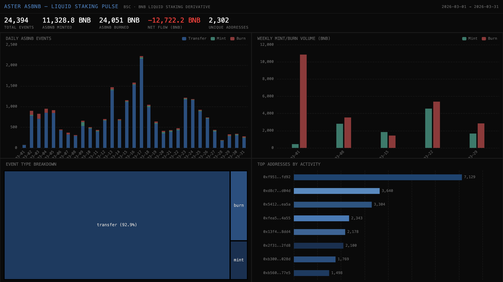

# 048 — Aster asBNB: Liquid Staking Pulse



Aster asBNB is a BNB liquid staking derivative on BSC that accrues rewards from Binance Launchpools, HODLer airdrops, and Megadrops. This indexer tracks the full asBNB lifecycle: token transfers (classified as mint/burn/transfer) plus domain events from the AsBnbMinter contract.

## Verification Report

```
=== Phase 1: Structural Checks ===
PASS: 24394 rows in asbnb_events
PASS: Column 'event_type' exists
PASS: Column 'transfer_type' exists
PASS: Column 'from_addr' exists
PASS: Column 'to_addr' exists
PASS: Column 'amount_bnb' exists
PASS: Column 'block_number' exists
PASS: Column 'tx_hash' exists
PASS: Column 'timestamp' exists
PASS: Timestamps: 2026-03-01 20:27:30.000 → 2026-03-31 16:03:05.000
PASS: 4 transfer types: burn, mint, transfer, compound
PASS: No negative amount_bnb values

=== Phase 2: Portal Cross-Reference ===
PASS: Portal cross-ref: CH=6, Portal=6 (0.0% diff, within 5%)

=== Phase 3: Transaction Spot-Checks ===
PASS: Spot-check tx 0x52a58bcd... block=89830559, type=transfer, 0.01 BNB — Portal confirms
PASS: Spot-check tx 0x6c3c4702... block=89830475, type=transfer, 0.00 BNB — Portal confirms
PASS: Spot-check tx 0x8ca06132... block=89828755, type=transfer, 0.02 BNB — Portal confirms

=== Results: 16 passed, 0 failed ===
```

## Run Instructions

```bash
docker compose up -d
npm install
npm start
npx tsx validate.ts
open dashboard/index.html
```

## Sample ClickHouse Query

```sql
-- Daily mint vs burn volume in BNB
SELECT
  toDate(timestamp) AS day,
  sumIf(amount_bnb, transfer_type = 'mint') AS minted,
  sumIf(amount_bnb, transfer_type = 'burn') AS burned,
  minted - burned AS net_flow
FROM aster_asbnb.asbnb_events
WHERE source_contract = 'asBNB'
GROUP BY day
ORDER BY day
```

## Architecture

- **Contracts**: asBNB Token (`0x7773...12b6`), AsBnbMinter Proxy (`0x2f31...fd8`) on BSC
- **Events**: `Transfer` (ERC20), `AsBnbMinted`, `AsBnbBurned`, `RewardsCompounded`
- **Chain**: BNB Smart Chain (binance-mainnet)
- **SDK**: `@subsquid/pipes@1.0.0-alpha.1`
