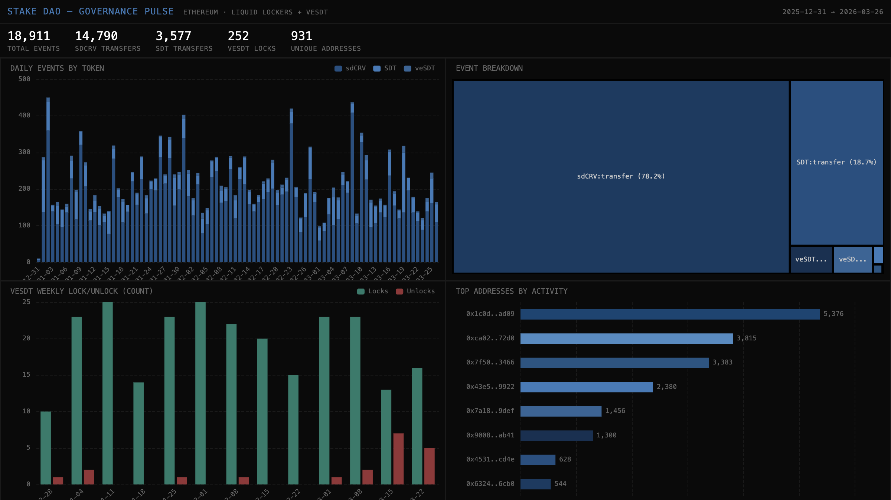

# 050 — Stake DAO: Governance Pulse



Stake DAO is a Liquid Lockers protocol on Ethereum. This indexer tracks the governance token lifecycle: sdCRV (liquid-locked CRV) transfers, SDT token transfers, and veSDT (vote-escrowed SDT) lock/unlock/supply events.

## Verification Report

```
=== Phase 1: Structural Checks ===
PASS: 18911 rows in stake_dao_events
PASS: Column 'event_type' exists
PASS: Column 'token' exists
PASS: Column 'from_addr' exists
PASS: Column 'to_addr' exists
PASS: Column 'amount_dec' exists
PASS: Column 'block_number' exists
PASS: Column 'tx_hash' exists
PASS: Column 'timestamp' exists
PASS: Timestamps: 2025-12-31 22:10:47.000 → 2026-03-26 19:37:35.000
PASS: 3 tokens: SDT, sdCRV, veSDT
PASS: 5 event types: transfer, mint, lock, supply_change, unlock

=== Phase 2: Portal Cross-Reference ===
PASS: Portal cross-ref: CH=26, Portal=26 (0.0% diff, within 5%)

=== Phase 3: Transaction Spot-Checks ===
PASS: Spot-check tx 0x378b2714... block=24743870, sdCRV transfer, 458.27 — Portal confirms
PASS: Spot-check tx 0xf5cec845... block=24743853, SDT transfer, 24.70 — Portal confirms
PASS: Spot-check tx 0xf5cec845... block=24743853, SDT transfer, 24.70 — Portal confirms

=== Results: 16 passed, 0 failed ===
```

## Run Instructions

```bash
docker compose up -d
npm install
npm start
npx tsx validate.ts
open dashboard/index.html
```

## Sample ClickHouse Query

```sql
-- Weekly veSDT lock activity
SELECT
  toStartOfWeek(toDate(timestamp)) AS week,
  countIf(event_type = 'lock') AS locks,
  countIf(event_type = 'unlock') AS unlocks,
  sumIf(amount_dec, event_type = 'lock') AS locked_sdt,
  sumIf(amount_dec, event_type = 'unlock') AS unlocked_sdt
FROM stake_dao.stake_dao_events
WHERE token = 'veSDT'
GROUP BY week
ORDER BY week
```

## Architecture

- **Contracts**: sdCRV (`0xd1b5...abb5`), SDT (`0x7396...db2f`), veSDT proxy (`0x0C30...9e8a`) on Ethereum
- **Events**: `Transfer` (ERC20), `Deposit`, `Withdraw`, `Supply`
- **Chain**: Ethereum Mainnet
- **SDK**: `@subsquid/pipes@1.0.0-alpha.1`
