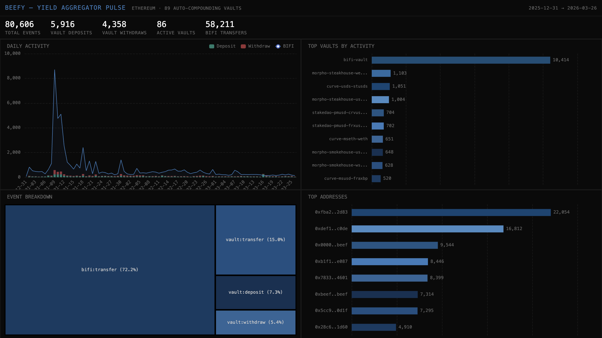

# 051 — Beefy: Yield Aggregator Pulse



Beefy is a multi-chain yield optimizer. This indexer tracks ALL 89 active auto-compounding vaults on Ethereum, classifying mooToken Transfer events as deposits (mint from zero) and withdrawals (burn to zero), plus BIFI governance token flows.

## Verification Report

```
=== Phase 1: Structural Checks ===
PASS: 80606 rows in beefy_events
PASS: Column 'source' exists
PASS: Column 'event_type' exists
PASS: Column 'vault_id' exists
PASS: Column 'from_addr' exists
PASS: Column 'to_addr' exists
PASS: Column 'amount_dec' exists
PASS: Column 'block_number' exists
PASS: Column 'tx_hash' exists
PASS: Column 'timestamp' exists
PASS: Timestamps: 2025-12-31 22:39:35.000 → 2026-03-26 19:36:11.000
PASS: 2 sources: bifi, vault
PASS: 3 event types: transfer, deposit, withdraw
PASS: 86 distinct vaults with activity

=== Phase 2: Portal Cross-Reference ===
PASS: Portal cross-ref: CH=85, Portal=85 (0.0% diff, within 5%)

=== Phase 3: Transaction Spot-Checks ===
PASS: Spot-check tx 0x2cb1f396... block=24743863, BIFI transfer — Portal confirms
PASS: Spot-check tx 0x2cb1f396... block=24743863, BIFI transfer — Portal confirms
PASS: Spot-check tx 0xb7ce242b... block=24743863, BIFI transfer — Portal confirms

=== Results: 18 passed, 0 failed ===
```

## Run Instructions

```bash
docker compose up -d
npm install
npm start
npx tsx validate.ts
open dashboard/index.html
```

## Sample ClickHouse Query

```sql
-- Top vaults by deposit count
SELECT
  vault_id,
  countIf(event_type = 'deposit') AS deposits,
  countIf(event_type = 'withdraw') AS withdraws,
  deposits - withdraws AS net
FROM beefy.beefy_events
WHERE source = 'vault'
GROUP BY vault_id
ORDER BY deposits DESC
LIMIT 20
```

## Architecture

- **Contracts**: 89 active vault contracts + BIFI token (`0xb1f1...b1f1`) on Ethereum
- **Events**: `Transfer` (ERC20) — classified as deposit/withdraw/transfer
- **Chain**: Ethereum Mainnet
- **SDK**: `@subsquid/pipes@1.0.0-alpha.1`
