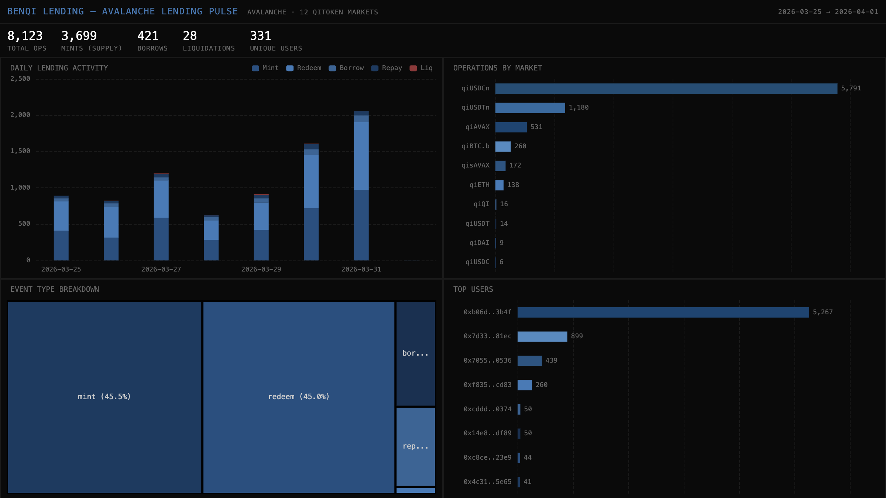

# 052 — Benqi Lending: Avalanche Lending Pulse



Benqi is a Compound-style lending protocol on Avalanche. This indexer tracks Mint, Redeem, Borrow, RepayBorrow, and LiquidateBorrow events across all 12 active qiToken markets.

## Verification Report

```
=== Phase 1: Structural Checks ===
PASS: 8123 rows in lending_events
PASS: Column 'event_type' exists
PASS: Column 'market' exists
PASS: Column 'user_addr' exists
PASS: Column 'amount_dec' exists
PASS: Column 'block_number' exists
PASS: Column 'tx_hash' exists
PASS: Column 'timestamp' exists
PASS: Timestamps: 2026-03-25 00:07:42.000 → 2026-04-01 00:00:26.000
PASS: 5 event types: borrow, mint, redeem, repay, liquidation
PASS: 12 markets: qiUSDCn, qiAVAX, qiBTC.b, qiETH, qiUSDTn, qisAVAX, qiBTC, qiDAI, qiLINK, qiQI, qiUSDC, qiUSDT

=== Phase 2: Portal Cross-Reference ===
PASS: Portal cross-ref: CH=4, Portal=4 (0.0% diff, within 5%)

=== Phase 3: Transaction Spot-Checks ===
PASS: Spot-check tx 0xe1c9b1a2... block=81789494, qiUSDCn mint — Portal confirms
PASS: Spot-check tx 0x0e41cdd7... block=81789177, qiUSDCn mint — Portal confirms
PASS: Spot-check tx 0x21485aa3... block=81789113, qiUSDCn mint — Portal confirms

=== Results: 15 passed, 0 failed ===
```

## Run Instructions

```bash
docker compose up -d && npm install && npm start
npx tsx validate.ts
open dashboard/index.html
```

## Architecture

- **Contracts**: 13 qiToken markets on Avalanche C-Chain
- **Events**: `Mint`, `Redeem`, `Borrow`, `RepayBorrow`, `LiquidateBorrow`
- **Chain**: Avalanche Mainnet (avalanche-mainnet)
- **SDK**: `@subsquid/pipes@1.0.0-alpha.1`
