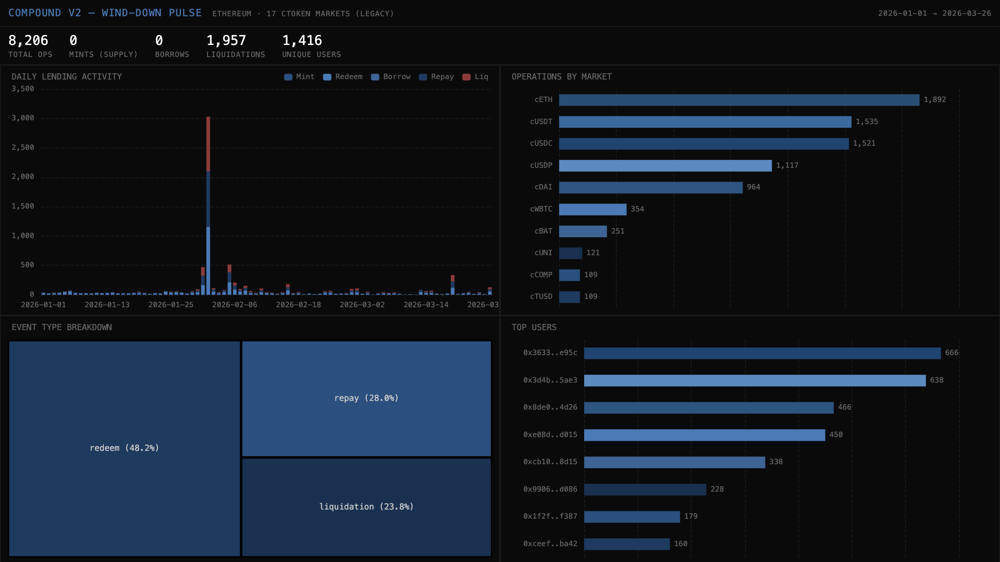

# 053 — Compound V2: Wind-Down Pulse



Compound V2 is the original Compound lending protocol on Ethereum, now in wind-down mode as activity has migrated to Compound V3 (Comet). This indexer shows the protocol sunset: zero new mints/borrows, only redeems, repays, and liquidations across 17 cToken markets.

## Verification Report

```
=== Phase 1: Structural Checks ===
PASS: 8206 rows in lending_events
PASS: 7/7 columns exist
PASS: Timestamps: 2026-01-01 01:41:47.000 → 2026-03-26 18:11:35.000
PASS: 3 event types: redeem, liquidation, repay (wind-down — no new mints/borrows)
PASS: 17 markets active

=== Phase 2: Portal Cross-Reference ===
PASS: Portal cross-ref: CH=1, Portal=1 (0.0% diff)

=== Phase 3: Transaction Spot-Checks ===
PASS: 3/3 spot-checks confirmed

=== Results: 15 passed, 0 failed ===
```

## Run Instructions

```bash
docker compose up -d && npm install && npm start
npx tsx validate.ts
open dashboard/index.html
```

## Architecture

- **Contracts**: 17 cToken markets on Ethereum (cETH, cDAI, cUSDC, cUSDT, cWBTC, etc.)
- **Events**: `Redeem`, `RepayBorrow`, `LiquidateBorrow` (no Mint/Borrow in wind-down)
- **Chain**: Ethereum Mainnet
- **SDK**: `@subsquid/pipes@1.0.0-alpha.1`
