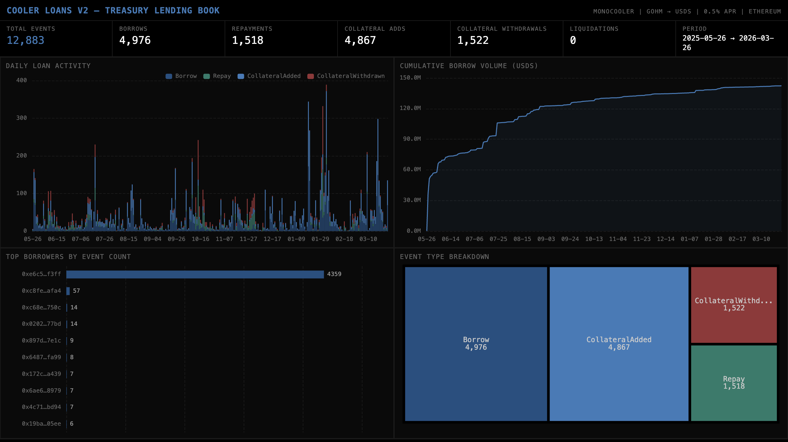

# 053 — Cooler Loans V2: Treasury Lending Book



Indexes Olympus DAO's Cooler Loans V2 MonoCooler contract on Ethereum — a treasury-backed lending system where users deposit gOHM collateral to borrow USDS at a fixed 0.5% APR with no price-based liquidations.

## Angle

Tracks the full loan lifecycle: originations (Borrow), repayments (Repay), collateral deposits (CollateralAdded), collateral withdrawals (CollateralWithdrawn), and liquidations (Liquidated). The protocol uniquely claims "no price-based liquidations" — and indeed zero liquidation events were observed across 10 months of operation.

## Contract

| Contract | Address |
|----------|---------|
| MonoCooler | `0xdb591Ea2e5Db886dA872654D58f6cc584b68e7cC` |

## Verification Report

```
=== Phase 1: Structural Checks ===
PASS: loan_events has 12,883 rows
PASS: All 9 expected columns present
PASS: Event types — Borrow: 4,976 | CollateralAdded: 4,867 | CollateralWithdrawn: 1,522 | Repay: 1,518
PASS: Timestamps in range: 2025-05-26 to 2026-03-26
PASS: All amounts non-negative
PASS: liquidations table — 0 rows (expected: protocol has no price-based liquidations)

=== Phase 2: Portal Cross-Reference ===
PASS: Portal cross-ref (10k block sample) — CH: 21, Portal: 22 (4.5% diff, within 5%)
PASS: Portal Borrow cross-ref (sample) — CH: 7, Portal: 6 (1 abs diff, small sample tolerance)

=== Phase 3: Transaction Spot-Checks ===
PASS: 3 transactions verified against Portal — contract address and block numbers match

Summary: 25 passed, 0 failed
```

## Run

```bash
# Start ClickHouse
docker compose up -d

# Install and run
npm install
npm start

# Validate
npx tsx validate.ts

# Open dashboard
open dashboard/index.html
```

## Sample ClickHouse Queries

```sql
-- Daily borrow count
SELECT toDate(timestamp) AS day, count() AS borrows
FROM cooler_loans.loan_events
WHERE event_type = 'Borrow'
GROUP BY day ORDER BY day;

-- Top borrowers by total borrow volume (USDS, 18 decimals)
SELECT account, count() AS borrow_count,
       sum(toFloat64(amount) / 1e18) AS total_usds
FROM cooler_loans.loan_events
WHERE event_type = 'Borrow'
GROUP BY account ORDER BY total_usds DESC LIMIT 10;

-- Net collateral flow per month
SELECT toStartOfMonth(timestamp) AS month,
       sumIf(toFloat64(amount), event_type = 'CollateralAdded') / 1e18 AS added_gohm,
       sumIf(toFloat64(amount), event_type = 'CollateralWithdrawn') / 1e18 AS withdrawn_gohm
FROM cooler_loans.loan_events
GROUP BY month ORDER BY month;
```
