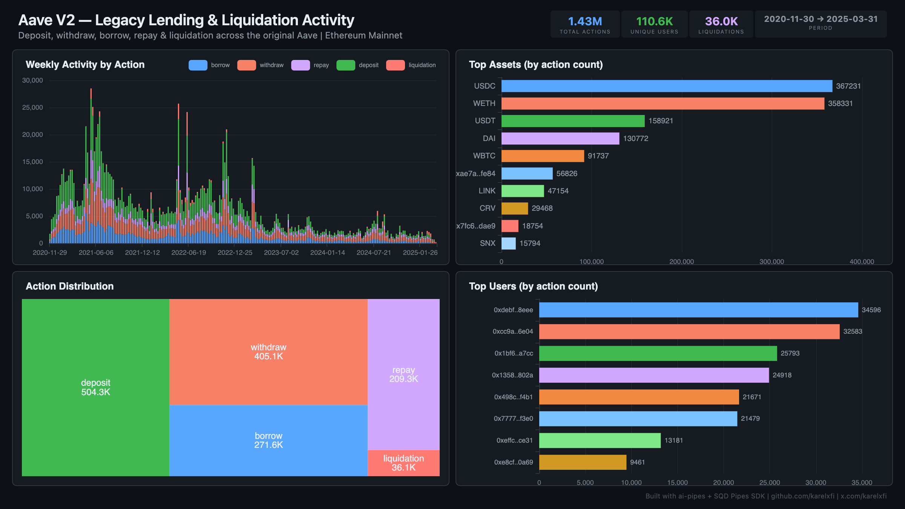

# Aave V2 — Legacy Lending & Liquidation Activity



Track the full lifecycle of Aave V2 on Ethereum — from the 2021 DeFi summer boom through migration to V3, including 36K liquidation events.

## Verification Report

```
=== Aave V2 Legacy Lending — Validation ===

── Phase 1: Structural Checks ──
PASS: Row count: 1424883
PASS: Schema OK: all 6 required columns present
  deposit: 503930 events
  withdraw: 404472 events
  borrow: 271578 events
  repay: 209155 events
  liquidation: 35748 events
PASS: 5 action types indexed (including liquidation)
PASS: Timestamp range: 2020-11-30 23:11:40 to 2025-03-19 04:51:35
PASS: 37 unique assets

── Phase 2: Portal Cross-Reference ──
PASS: Portal cross-ref — blocks 16720850-16730850: ClickHouse=872, Portal=872 (0.0% diff)

── Phase 3: Transaction Spot-Checks ──
PASS: Spot-check tx 0x965cdf2a... — block 22078648, withdraw confirmed
PASS: Spot-check tx 0xda0e5ef4... — block 22078563, deposit confirmed
PASS: Spot-check tx 0x5ec96a48... — block 22078426, withdraw confirmed

=== SUMMARY: 9 passed, 0 failed ===
```

## Run

```bash
docker compose up -d
npm install
npm start
```

## Dashboard

Open `dashboard/index.html` after syncing.

## Sample Query

```sql
SELECT action, count() as events, count(DISTINCT user) as users
FROM aave_v2.aave_v2_actions
GROUP BY action
ORDER BY events DESC
```

## Contract Indexed

| Contract | Address | Notes |
|----------|---------|-------|
| Aave V2 LendingPool | `0x7d2768dE32b0b80b7a3454c06BdAc94A69DDc7A9` | Proxy — impl `0xc6845a5c...` |
