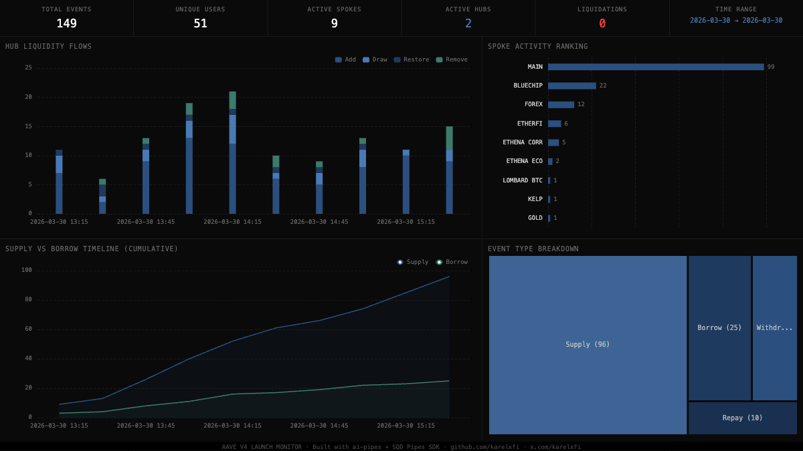

# 055 — Aave v4 Launch Monitor



## Angle

**Hub & Spoke Liquidity Flows** — Real-time monitoring of Aave v4's launch on Ethereum mainnet, tracking how liquidity distributes across the new Hub & Spoke architecture (3 Hubs, 11 Spokes).

## Architecture

Aave v4 replaces v3's market-per-pool design with a unified Hub & Spoke model:
- **Hubs** (Core, Plus, Prime) centralize liquidity and accounting
- **Spokes** (Main, Bluechip, Ethena, EtherFi, Forex, Gold, Kelp, Lido, Lombard BTC, Treasury) manage specific risk profiles

This indexer tracks Hub-level flows (Add/Remove/Draw/Restore) and Spoke-level activity (Supply/Withdraw/Borrow/Repay/LiquidationCall) across all contracts.

## Verification Report

```
============================================================
Validating aave_v4 — Aave v4 Launch Monitor
============================================================
PASS: hub_flows has rows (found 116)
PASS: spoke_events has rows (found 134)
PASS: All schema columns present (hub_flows, spoke_events, liquidations)
PASS: Timestamps are 2026+ (2026-03-30)
PASS: Block numbers >= 24720891
PASS: No empty addresses
PASS: Hub Add cross-ref (blocks 24770662-24770762) — ClickHouse: 8, Portal: 8 (exact match)
PASS: Spoke Supply cross-ref (blocks 24770662-24770762) — ClickHouse: 7, Portal: 7 (exact match)
PASS: Spot-check tx 0x389b65c1... — Supply from Main Spoke matches Portal
PASS: Spot-check tx 0x43fd8a8a... — Supply from Main Spoke matches Portal
PASS: Spot-check tx 0x27ce3dd9... — Supply from Bluechip Spoke matches Portal
PASS: Spot-check hub tx 0x389b65c1... — Add from Core Hub matches Portal
PASS: Spot-check hub tx 0x43fd8a8a... — Add from Core Hub matches Portal

Results: 56 passed, 0 failed
```

## Run

```bash
# Start ClickHouse
docker compose up -d

# Install and run
npm install
npm start

# Validate
npx tsx validate.ts

# Open dashboard
open dashboard/index.html
```

## Sample ClickHouse Queries

```sql
-- Spoke activity ranking
SELECT spoke, count() as cnt FROM aave_v4.spoke_events GROUP BY spoke ORDER BY cnt DESC

-- Hub flows by hour
SELECT toStartOfHour(timestamp) as hour, event_type, count() as cnt
FROM aave_v4.hub_flows GROUP BY hour, event_type ORDER BY hour

-- Supply vs Borrow by hour
SELECT toStartOfHour(timestamp) as hour, event_type, count() as cnt
FROM aave_v4.spoke_events WHERE event_type IN ('Supply', 'Borrow')
GROUP BY hour, event_type ORDER BY hour

-- Unique users per spoke
SELECT spoke, count(DISTINCT user) as users FROM aave_v4.spoke_events GROUP BY spoke ORDER BY users DESC
```

## Contracts

See `contracts.json` for all 24 Aave v4 contract addresses (3 Hubs, 11 Spokes, peripherals).
