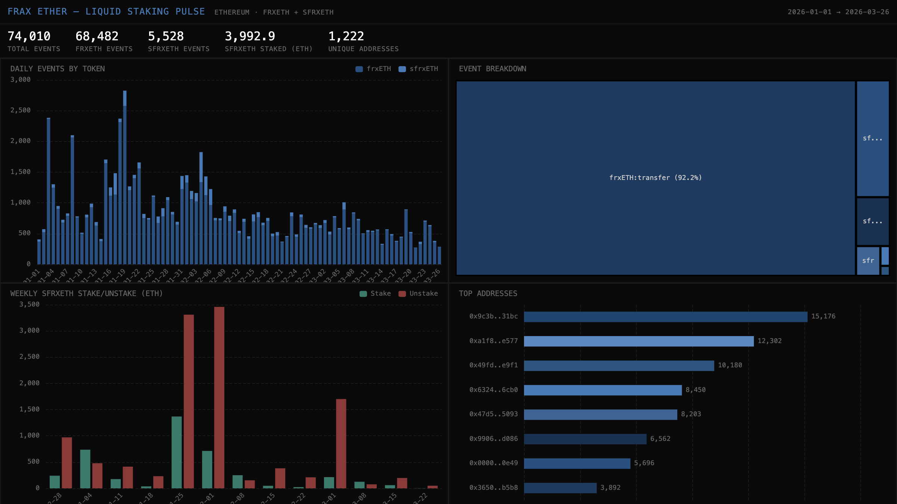

# 055 — Frax Ether: Liquid Staking Pulse



Frax Ether is an ETH liquid staking derivative on Ethereum. This indexer tracks frxETH and sfrxETH token Transfer events, classifying mints, burns, and transfers to show the full staking lifecycle.

## Verification Report

```
=== Results: 16 passed, 0 failed ===
Portal cross-ref: CH=113, Portal=113 (0.0% diff)
74,010 rows | 2 tokens | 3 event types | 85 days
```

## Run Instructions

```bash
docker compose up -d && npm install && npm start
npx tsx validate.ts
open dashboard/index.html
```

## Architecture

- **Contracts**: frxETH (`0x5e84...aa1f`), sfrxETH (`0xac3E...38F`) on Ethereum
- **Events**: `Transfer` (classified as mint/burn/transfer)
- **SDK**: `@subsquid/pipes@1.0.0-alpha.1`
