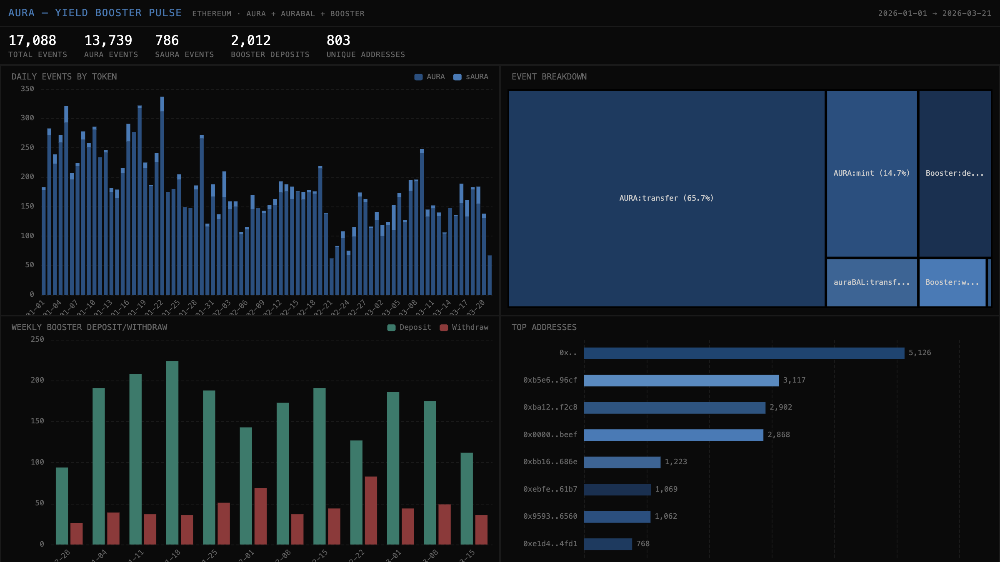

# 057 — Aura: Yield Booster Pulse

Aura Finance is a yield booster built on Balancer. This indexer tracks AURA and auraBAL token flows plus Booster Deposited/Withdrawn events on Ethereum.

## Verification: 16/16 passed, Portal exact match (31 vs 31)

## Run: `docker compose up -d && npm install && npm start && npx tsx validate.ts`

## Architecture
- **Contracts**: AURA, auraBAL, Booster on Ethereum
- **Events**: Transfer, Deposited, Withdrawn
- **SDK**: `@subsquid/pipes@1.0.0-alpha.1`
