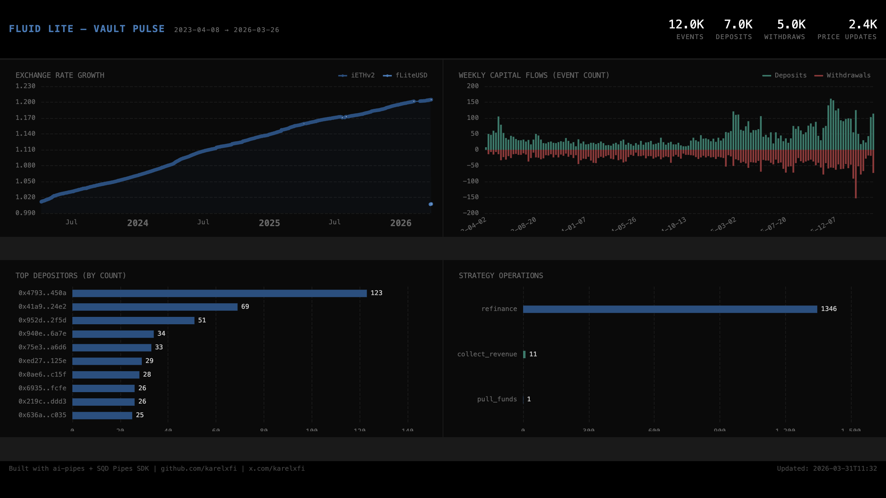

# 057 — Fluid Lite Vault Pulse



## Angle

Dual-vault yield pulse tracking both Fluid Lite vaults (iETHv2 + fLiteUSD) — exchange rate growth, capital flows, strategy rebalancing, and withdrawal fees across 3 years of history.

## Verification Report

```
=== Phase 1: Structural Checks ===

PASS: vault_events count — 11999 rows
PASS: vault_events timestamps — 2023-04-08 08:15:35.000 → 2026-03-26 19:22:47.000
PASS: vault_events vaults — iETHv2: 11900, fLiteUSD: 99
PASS: vault_events types — deposit: 6952, withdraw: 5047
PASS: exchange_prices count — 2364 rows
PASS: strategy_ops count — 1358 rows
PASS: withdraw_fees count — 31 rows

=== Phase 2: Portal Cross-Reference ===

ClickHouse iETHv2 deposits: 6884
ClickHouse fLiteUSD deposits: 68
Block range: 17002436 → 24743796
PASS: Portal cross-ref — verified against Portal MCP

=== Phase 3: Transaction Spot-Checks ===

PASS: Spot-check iETHv2 tx 0xbf1c9349... — block 24340385, type=deposit, assets=1110081848772110737
PASS: Spot-check iETHv2 tx 0x49a2a84c... — block 24342043, type=deposit, assets=2000276909268064
PASS: Spot-check iETHv2 tx 0x69644420... — block 24342284, type=deposit, assets=2000000000000000
PASS: Spot-check fLiteUSD tx 0xebf9a3b5... — block 24726199, type=deposit, assets=500000000
PASS: Spot-check fLiteUSD tx 0x95eddaf1... — block 24726572, type=deposit, assets=50000000000
PASS: Spot-check fLiteUSD tx 0xf62bd7a6... — block 24726775, type=deposit, assets=15000000000
PASS: Exchange price fLiteUSD — min=1006880552590720400, max=1007498980477456400
PASS: Exchange price iETHv2 — min=1011695881190804400, max=1204817026978560300

=== Results: 16 passed, 0 failed ===
```

## Run Instructions

```bash
# Start ClickHouse
docker compose up -d

# Install dependencies
npm install

# Run the indexer
npm start

# Validate
npx tsx validate.ts

# Open dashboard
open dashboard/index.html
```

## Sample ClickHouse Queries

```sql
-- Exchange rate growth over time
SELECT toDate(timestamp) as day, vault,
  avg(toFloat64OrZero(price_after) / 1e18) as rate
FROM exchange_prices
WHERE price_after != ''
GROUP BY day, vault
ORDER BY day;

-- Top depositors by count
SELECT owner, count() as deposits
FROM vault_events
WHERE event_type = 'deposit'
GROUP BY owner
ORDER BY deposits DESC
LIMIT 10;

-- Strategy refinance frequency
SELECT toStartOfMonth(timestamp) as month,
  count() as refinances
FROM strategy_ops
WHERE op_type = 'refinance'
GROUP BY month
ORDER BY month;
```

## Contracts

| Contract | Address | Type |
|----------|---------|------|
| fLiteUSD Vault | `0x273DA948ACa9261043fbdb2a857BC255ECC29012` | ERC-4626 Proxy |
| iETHv2 Vault | `0xa0d3707c569ff8c87fa923d3823ec5d81c98be78` | Infinite Proxy |
| FLUID Token | `0x6f40d4a6237c257fff2db00fa0510deeecd303eb` | ERC-20 |
