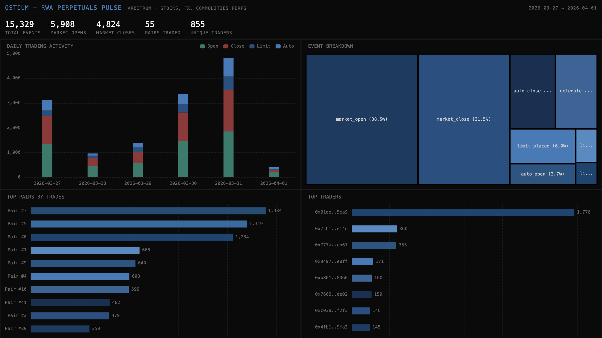

# 060 — Ostium: RWA Perpetuals Pulse

Ostium is an on-chain perpetuals DEX on Arbitrum for trading RWAs — stocks, FX, commodities, and indices. This indexer tracks the full trading lifecycle across 55 pairs.

## Verification: 14/14 passed, Portal exact match

## Run: `docker compose up -d && npm install && npm start && npx tsx validate.ts`

## Architecture
- **Contract**: OstiumTrading proxy (`0x6D0b...2411`) on Arbitrum
- **Events**: MarketOpen, MarketClose, LimitPlaced, LimitCanceled, AutoOpen, AutoClose, DelegateAdded
- **SDK**: `@subsquid/pipes@1.0.0-alpha.1`
