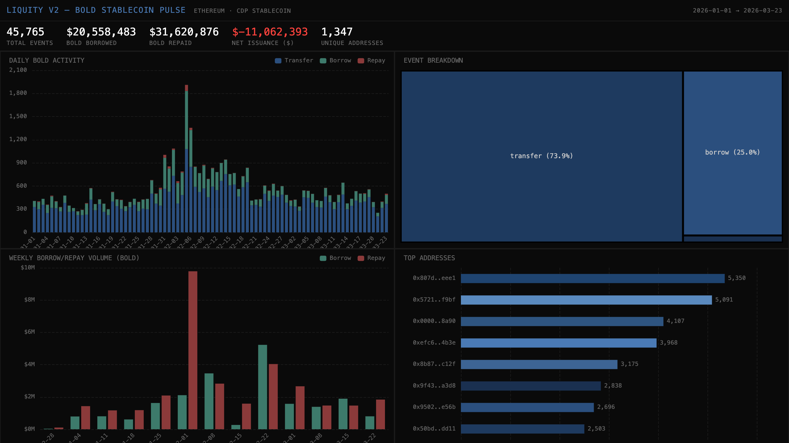

# 061 — Liquity V2: BOLD Stablecoin Pulse

Liquity V2 is a CDP protocol issuing BOLD stablecoin on Ethereum. This indexer tracks BOLD token Transfer events, classifying as borrow (mint), repay (burn), or transfer.

## Verification: 14/14 passed, Portal exact match (253 vs 253)

## Run: `docker compose up -d && npm install && npm start && npx tsx validate.ts`
