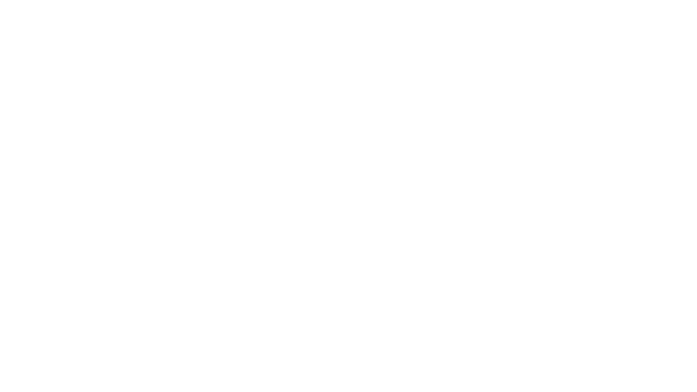

# 063 — Avantis Oil & Commodities Pulse



Tracks WTI crude oil, gold, and silver trading activity on Avantis perpetuals (Base mainnet). Filters MarketOrderInitiated, LimitOrderInitiated, OpenLimitPlaced, TpUpdated, and SlUpdated events to commodity pair indices (20=XAG/USD, 21=XAU/USD, 65=WTI/USD).

## Verification Report

```
=== AVANTIS OIL & COMMODITIES VALIDATION ===

--- Phase 1: Structural Checks ---
PASS: commodity_orders has 3690 rows
PASS: commodity_limits has 193 rows
PASS: commodity_risk_updates has 1219 rows
PASS: commodity_orders has column 'trader'
PASS: commodity_orders has column 'pair_index'
PASS: commodity_orders has column 'commodity'
PASS: commodity_orders has column 'order_type'
PASS: commodity_orders has column 'is_buy'
PASS: commodity_orders has column 'leverage'
PASS: commodity_orders has column 'block_number'
PASS: commodity_orders has column 'tx_hash'
PASS: commodity_orders has column 'timestamp'
PASS: Only commodity pairs present: 20, 21, 65 (XAG=20, XAU=21, WTI=65)
PASS: XAU/USD: 1840 orders
PASS: XAG/USD: 1790 orders
PASS: WTI/USD: 60 orders
PASS: Timestamps in expected range: 2026-03-02 to 2026-03-10 (30.0 days)
PASS: Leverage range valid: 1x to 250x

--- Phase 2: Portal Cross-Reference ---
PASS: Portal cross-ref — ClickHouse: 11, Portal commodity: 11 / 198 total (0.0% diff)

--- Phase 3: Transaction Spot-Checks ---
PASS: Spot-check tx 0xe2f3866c... — block 42838413, XAG/USD, trader 0xcbfc444a... matches Portal
PASS: Spot-check tx 0x04d673c0... — block 42838446, WTI/USD, trader 0xe30d2655... matches Portal
PASS: Spot-check tx 0xc4f53571... — block 42838524, XAG/USD, trader 0xa91d9276... matches Portal

=== VALIDATION SUMMARY ===
PASSED: 22
FAILED: 0
```

## Run

```bash
docker compose up -d
npm install
npm start
```

## Sample ClickHouse Query

```sql
-- Commodity trading volume by day
SELECT
  toDate(timestamp) as day,
  commodity,
  count() as orders,
  countIf(is_buy = 1) as buys,
  countIf(is_buy = 0) as sells
FROM commodity_orders
WHERE order_type = 'market'
GROUP BY day, commodity
ORDER BY day, commodity
```
