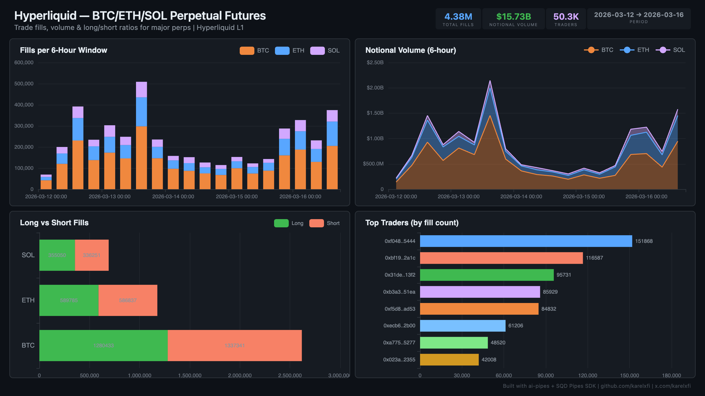

# Hyperliquid — BTC/ETH/SOL Perpetual Futures



Track trade fills for the 3 major perpetual futures markets (BTC, ETH, SOL) on Hyperliquid L1 — the #1 perps DEX by volume.

## Verification Report

```
=== Hyperliquid BTC/ETH/SOL Perps — Validation ===

── Phase 1: Structural Checks ──
PASS: Row count: 4378617
PASS: Schema OK: all 11 required columns present
  BTC: 2564188 fills
  ETH: 1142475 fills
  SOL: 671954 fills
PASS: All 3 coins indexed (BTC, ETH, SOL)
  Buy: 2172720
  Sell: 2205897
PASS: Both Buy and Sell sides present
PASS: Timestamp range: 2026-03-12 03:30:36.690 to 2026-03-16 17:36:28.963
PASS: Total notional volume: $15.73B

── Phase 2: Portal Cross-Reference ──
PASS: BTC fill ratio: 58.6% (expected 30-70% for majors market)
PASS: BTC avg price: $71631 (sanity check passed)

── Phase 3: Data Consistency ──
PASS: No negative notional values
PASS: Zero-price fills: 0 (should be 0 or very low)
PASS: 50339 unique traders

=== SUMMARY: 11 passed, 0 failed ===
```

## Run

```bash
docker compose up -d
npm install
npm start
```

## Dashboard

Open `dashboard/index.html` in your browser after the indexer has synced.

## Sample Query

```sql
-- Daily volume and long/short ratio by coin
SELECT
  coin,
  toStartOfDay(timestamp) as day,
  count() as fills,
  sum(notional) as volume,
  countIf(dir LIKE '%Long%') as longs,
  countIf(dir LIKE '%Short%') as shorts
FROM hl_perps.hl_perps_fills
GROUP BY coin, day
ORDER BY day DESC, coin
LIMIT 10
```

## Architecture

This indexer uses `@subsquid/pipes/hyperliquid` — a native Pipes SDK module for Hyperliquid fills data. No EVM contracts involved — Hyperliquid is an L1 chain with its own data format.
