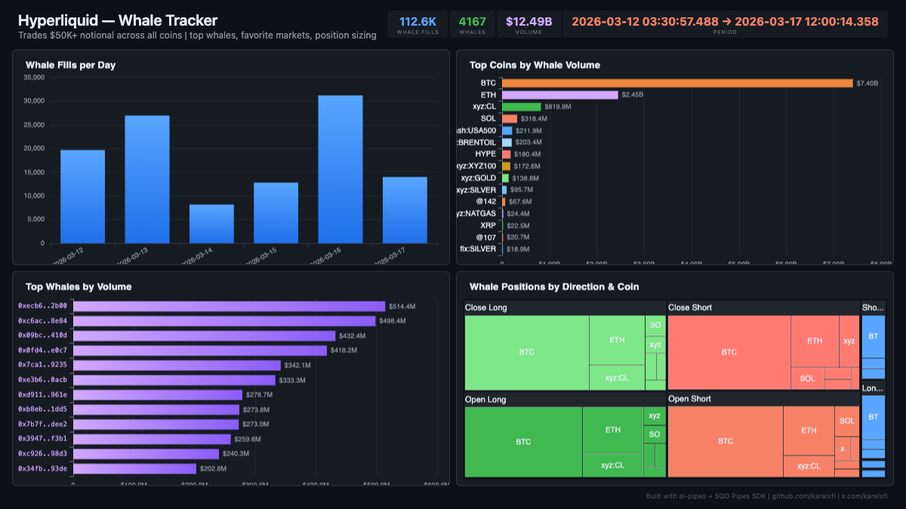

# Hyperliquid — Whale Tracker



Track high-value trades ($50K+ notional) across ALL Hyperliquid coins. Reveals whale favorite markets beyond just BTC/ETH — including crude oil, gold, index products, and altcoins. 112K+ whale fills from 4,167 unique addresses totaling $12.49B in volume.

## Verification Report

```
=== Hyperliquid Whale Tracker — Validation ===

── Phase 1: Structural Checks ──
PASS: Row count: 112626
PASS: Schema OK: all 12 required columns present
PASS: Timestamp range: 2026-03-12 03:30:57.488 to 2026-03-17 12:00:14.358
PASS: Min notional: $50000 (all fills >= $50K threshold)
  Top coins by whale fills:
    BTC: 63687
    ETH: 19205
    xyz:CL: 9520
    SOL: 4260
    xyz:BRENTOIL: 2613
    xyz:XYZ100: 1989
    cash:USA500: 1664
    HYPE: 1373
    xyz:GOLD: 1248
    xyz:SILVER: 1136
PASS: 10 unique coins with whale fills
  Buy: 56251
  Sell: 56375
PASS: Both Buy and Sell sides present

── Phase 2: Whale Sanity Checks ──
PASS: Average whale trade size: $110.9K
PASS: 4167 unique whale addresses
PASS: Total whale notional: $12.49B
PASS: BTC avg whale trade: $116.3K

── Phase 3: Data Consistency ──
PASS: No negative notional values
PASS: No empty user addresses
PASS: All 9 direction types valid: Close Long(27158), Close Short(26122), Open Long(26024), Open Short(25082), Long > Short(3485), Short > Long(3464), Sell(645), Buy(636), Net Child Vaults(10)

=== SUMMARY: 13 passed, 0 failed ===
```

## Run

```bash
docker compose up -d
npm install
npm start
```

## Dashboard

Open `dashboard/index.html` in your browser after the indexer has synced.

## Sample Query

```sql
-- Top whale addresses by total volume
SELECT
  user,
  count() as fills,
  round(sum(notional) / 1e6, 1) as volume_m,
  round(avg(notional) / 1000, 1) as avg_size_k
FROM hl_whale_fills
GROUP BY user
ORDER BY volume_m DESC
LIMIT 10
```
