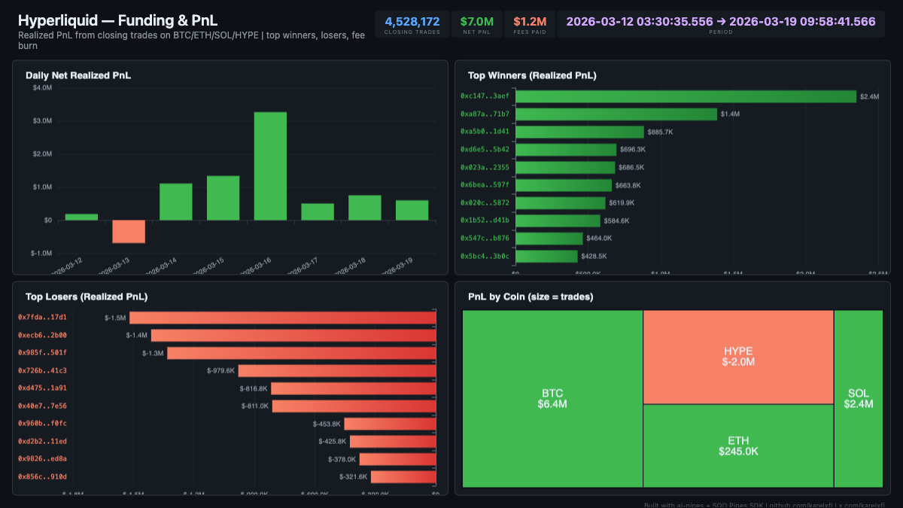

# Hyperliquid — Funding & PnL



Track realized profit & loss from closing trades on BTC/ETH/SOL/HYPE. 4.5M+ closing trades from 66K traders showing $7M net PnL and $1.2M in fees over 8 days.

## Verification Report

```
=== Hyperliquid Funding & PnL — Validation ===

── Phase 1: Structural Checks ──
PASS: Row count: 4528172
PASS: Schema OK: all 11 required columns present
PASS: Timestamp range: 2026-03-12 03:30:35.556 to 2026-03-19 09:58:41.566
PASS: All fills have non-zero closedPnl (closing trades only)
  BTC: 1945609 closing trades
  HYPE: 1087122 closing trades
  ETH: 963645 closing trades
  SOL: 531796 closing trades
PASS: 4 coins with PnL data

── Phase 2: PnL Sanity Checks ──
PASS: Net realized PnL: $7.04M
PASS: Total fees paid: $1.21M
PASS: Profitable closes: 2339522, Losing closes: 2188650
PASS: 66124 unique traders with realized PnL

── Phase 3: Data Consistency ──
PASS: No empty user addresses
PASS: Both sides present: Buy(2189282), Sell(2338890)
PASS: Direction breakdown: Close Long(2219122), Close Short(2067781), Short > Long(121500), Long > Short(119767), Net Child Vaults(2)

=== SUMMARY: 12 passed, 0 failed ===
```

## Run

```bash
docker compose up -d
npm install
npm start
```

## Dashboard

Open `dashboard/index.html` in your browser after the indexer has synced.

## Sample Query

```sql
-- Top traders by net realized PnL
SELECT
  user,
  count() as closing_trades,
  round(sum(closed_pnl), 2) as net_pnl,
  round(sum(fee), 2) as total_fees,
  round(sum(closed_pnl) - sum(fee), 2) as net_after_fees
FROM hl_pnl_fills
GROUP BY user
ORDER BY net_pnl DESC
LIMIT 10
```
