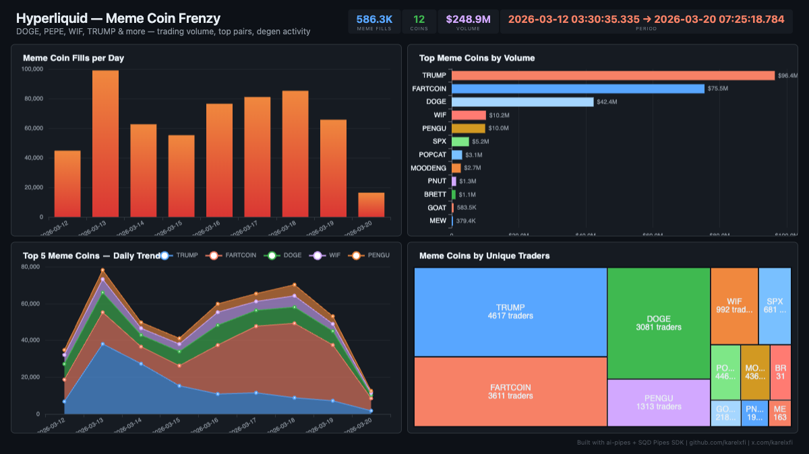

# Hyperliquid — Meme Coin Frenzy



Track the degen meme coin market on Hyperliquid — TRUMP, FARTCOIN, DOGE, WIF, and 8 more. 586K fills from 10K traders across $249M in volume over 9 days. TRUMP leads by volume while FARTCOIN dominates fill count.

## Verification Report

```
=== Hyperliquid Meme Coins — Validation ===

── Phase 1: Structural Checks ──
PASS: Row count: 586325
PASS: Schema OK: all 11 required columns present
PASS: Timestamp range: 2026-03-12 03:30:35.335 to 2026-03-20 07:25:18.784
  Meme coins by fill count:
    FARTCOIN: 189403
    TRUMP: 127509
    DOGE: 71007
    WIF: 42878
    PENGU: 34020
    SPX: 33596
    POPCAT: 21350
    MOODENG: 20467
    BRETT: 15360
    PNUT: 14644
    GOAT: 10122
    MEW: 5969
PASS: 12 meme coins indexed
PASS: Sides: Sell(586325) (fills API returns one counterparty per fill)

── Phase 2: Meme Coin Sanity Checks ──
PASS: Total meme coin volume: $248.9M
PASS: 10095 unique meme coin traders
PASS: DOGE avg price: $0.0971 (sanity check)

── Phase 3: Data Consistency ──
PASS: No negative notional values
PASS: No empty user addresses
PASS: Direction breakdown: Close Long(296686), Open Short(274066), Long > Short(15572), Net Child Vaults(1)

=== SUMMARY: 11 passed, 0 failed ===
```

## Run

```bash
docker compose up -d
npm install
npm start
```

## Dashboard

Open `dashboard/index.html` in your browser after the indexer has synced.

## Sample Query

```sql
-- Top meme coins by unique trader count
SELECT
  coin,
  count(DISTINCT user) as traders,
  count() as fills,
  round(sum(notional) / 1e6, 1) as volume_m
FROM hl_meme_fills
GROUP BY coin
ORDER BY traders DESC
```
