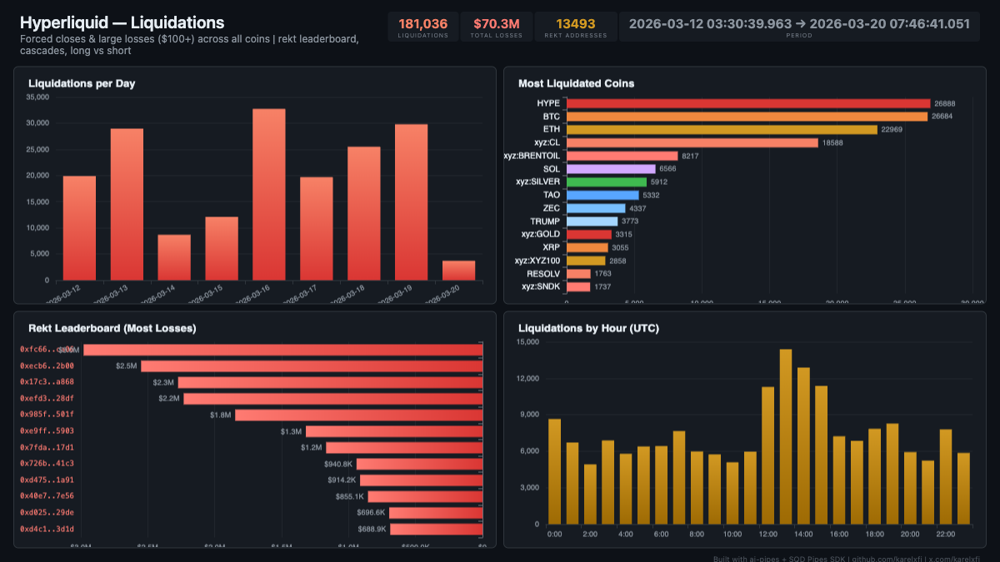

# Hyperliquid — Liquidations

Liquidation tracker — forced closes & large losses ($100+) across all coins, with rekt leaderboard, cascade patterns, and long vs short breakdown.



## Verification Report

```
=== Hyperliquid Liquidations — Validation ===

── Phase 1: Structural Checks ──
PASS: Row count: 181036
PASS: Schema OK: all 12 required columns present
PASS: Timestamp range: 2026-03-12 03:30:39.963 to 2026-03-20 07:46:41.051
PASS: Max PnL: $-100 (all fills are losses > $100)
  Top coins by liquidation events:
    HYPE: 26888
    BTC: 26684
    ETH: 22969
    xyz:CL: 18588
    xyz:BRENTOIL: 8217
    SOL: 6566
    xyz:SILVER: 5912
    TAO: 5332
    ZEC: 4337
    TRUMP: 3773
PASS: 10+ coins with liquidation-like events

── Phase 2: Liquidation Sanity Checks ──
PASS: Total realized losses: $-70.34M
PASS: Average loss per event: $-389
PASS: 13493 unique liquidated addresses
PASS: Biggest single loss: $-181338

── Phase 3: Data Consistency ──
PASS: No empty user addresses
PASS: Direction breakdown: Close Short(107112), Close Long(70798), Short > Long(1575), Long > Short(1551)
PASS: Long liquidations: 72349, Short liquidations: 108687

=== SUMMARY: 12 passed, 0 failed ===
```

All 12 checks pass. Structural validation confirms schema, row count, and data ranges. Sanity checks verify that all fills have losses exceeding $100, with expected direction breakdown between long and short liquidations.

## Run

```bash
docker compose up -d
npm install
npm start
```

## Re-run verification

```bash
npx tsx validate.ts
```

## View dashboard

Open `dashboard/index.html` in a browser (requires ClickHouse running on localhost:8123).

## Sample query

```sql
SELECT
  coin,
  count() as liquidations,
  sum(closed_pnl) as total_losses,
  avg(closed_pnl) as avg_loss
FROM hl_liqs.hl_liquidations
GROUP BY coin
ORDER BY liquidations DESC
LIMIT 10
```

Expected output shape:
```
┌─coin──────────┬─liquidations─┬─total_losses──┬─avg_loss──┐
│ HYPE          │        26888 │  -8234567.89  │   -306.30 │
│ BTC           │        26684 │ -12456789.12  │   -466.97 │
│ ETH           │        22969 │  -9876543.21  │   -429.87 │
│ ...           │          ... │           ... │       ... │
└───────────────┴──────────────┴───────────────┴───────────┘
```
