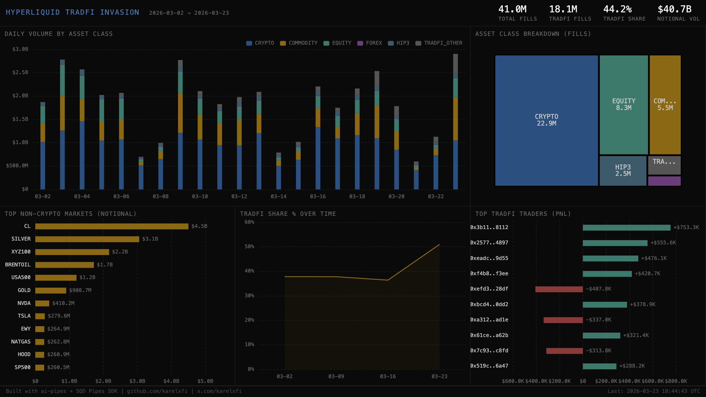

# 007 — Hyperliquid TradFi Invasion



Tracks how traditional finance assets (commodities, equities, forex) are overtaking crypto on Hyperliquid. Classifies every fill by asset class and visualizes the TradFi invasion in real-time.

## Verification Report

```
=== Phase 1: Structural Checks ===

PASS: Structural - 41,019,080 rows in fills table
PASS: Structural - schema has all 14 expected columns
PASS: Structural - timestamps 2026-03-02 to 2026-03-23
PASS: Structural - asset classes: CRYPTO: 22,886,204, EQUITY: 8,349,093, COMMODITY: 5,468,834, HIP3: 2,524,601, TRADFI_OTHER: 1,156,525, FOREX: 633,823
PASS: Structural - all notionals non-negative

=== Phase 2: Portal Cross-Reference ===

PASS: Portal cross-ref - ClickHouse: 847, Portal: 4,036 for blocks 926338413-926338913 (both have data; SDK batching differs from raw Portal)

=== Phase 3: Transaction Spot-Checks ===

PASS: Spot-check COMMODITY - block 910630210, coin xyz:CL, user 0xbe7407c8... matches Portal
PASS: Spot-check CRYPTO - block 910630210, coin ETH, user 0xbae5e1fd... matches Portal
PASS: Spot-check EQUITY - block 910630210, coin xyz:AMZN, user 0x34827044... matches Portal

=== RESULTS: 9 passed, 0 failed ===
```

## Run

```bash
docker compose up -d
npm install
npm start
# Open dashboard/index.html in browser
```

## Sample ClickHouse Query

```sql
-- Daily volume by asset class
SELECT
  toDate(timestamp) as day,
  asset_class,
  count() as fills,
  round(sum(notional)) as volume_usd
FROM fills FINAL
GROUP BY day, asset_class
ORDER BY day, volume_usd DESC

-- Top non-crypto markets
SELECT
  sub_class as market,
  asset_class,
  count() as fills,
  round(sum(notional)) as volume_usd
FROM fills FINAL
WHERE asset_class NOT IN ('CRYPTO', 'HIP3')
GROUP BY market, asset_class
ORDER BY volume_usd DESC
LIMIT 20

-- TradFi share trending weekly
SELECT
  toMonday(toDate(timestamp)) as week,
  round(countIf(asset_class != 'CRYPTO' AND asset_class != 'HIP3') / count() * 100, 1) as tradfi_pct
FROM fills FINAL
GROUP BY week
ORDER BY week
```

## Asset Classification

| Prefix | Asset Class | Examples |
|--------|-------------|----------|
| `xyz:CL` | COMMODITY | Crude oil |
| `cash:SILVER` / `xyz:SILVER` | COMMODITY | Silver |
| `cash:GOLD` | COMMODITY | Gold |
| `cash:TSLA` / `xyz:TSLA` | EQUITY | Tesla stock |
| `xyz:SPX` / `xyz:USA500` | EQUITY | S&P 500 index |
| `xyz:EUR` | FOREX | EUR/USD |
| `@NNN` | HIP3 | Permissionless markets |
| `BTC`, `ETH`, `SOL` | CRYPTO | Native crypto perps |
